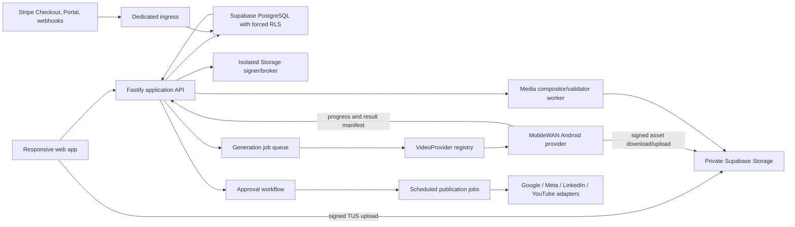

# SUPERSEDED: Review Anchor MobileWAN Paid Video Automation — Product and Technical Implementation Plan

> **Do not execute this document.** It described an Android/on-device direction that the product owner replaced with a browser control plane and managed NVIDIA GPU worker. The canonical plan is `docs/superpowers/plans/2026-07-21-review-anchor-simplified-product-implementation.md`.

**Date:** 2026-07-21  
**Status:** Superseded; retained for history and not approved for execution  
**Repository:** `C:\Users\Nick\Documents\Review App`  
**Implementation state:** Planning only. This document does not authorize video integration.

## 1. Hard stop and implementation gate

No application code is started in this planning turn. After the product owner approves the plan and separately asks execution to begin, provider-independent foundations such as onboarding, manual upload, Google Profile consolidation, approval, and manual social publishing may proceed without MobileWAN. Any MobileWAN-specific provider adapter, model wrapper, native runtime, generation job activation, or paid Generate control requires both conditions below:

1. The product owner approves this plan, including the commercial defaults and retention policy.
2. The production MobileWAN artifacts in section 23 are supplied and pass the licensing and feasibility gate.

There will be no fake production provider, temporary hosted model, hidden fallback model, or endpoint that claims to generate video without the real approved runtime. Contract test doubles are permitted only inside automated tests; they will never be selectable in a deployed environment.

## 2. Executive decision

Build one focused content product around three actions:

1. Create or upload a short promotional video.
2. Approve it.
3. Publish it once or on a schedule to Google Business Profile, Facebook, Instagram, LinkedIn, and YouTube.

The existing responsive web application remains the customer and agency control plane. MobileWAN runs behind a replaceable `VideoProvider` interface. The recommended first provider is a minimal native Android companion/runtime on explicitly supported Snapdragon devices. It receives signed generation work, runs the model locally, uploads the output securely, and reports progress. The customer should not have to learn a second product UI.

The architecture also permits a future server-hosted provider without changing projects, billing, approvals, or social publishing. MobileWAN must not be imported throughout the application or encoded into database state transitions.

## 3. Product scope

### Keep and strengthen

- Google Business Profile setup, reviews, posts, offers, image uploads, and video uploads under one **Google Profile** area.
- Manual video upload and publishing for free users.
- Paid automatic short-video creation through MobileWAN.
- Facebook, Instagram, LinkedIn, YouTube, and Google Business Profile publishing.
- Business/location selection, agency client control, approval, scheduling, retries, and reporting.
- Review requests and QR codes already present in the application.
- Simple video changes: trim, caption text, licensed music selection, thumbnail, focal crop, and regenerate.

### Explicitly out of scope

- A professional timeline editor, layers panel, keyframes, colour grading, effects marketplace, or collaborative frame-level editing.
- Native arbitrary-length generation when the provider does not support it.
- Citation management, heatmap/rank tracking, website widgets, white-label domains, complex strategy automation, Zapier/CompanyCam, geotagging, metadata tricks, and other high-effort features from the earlier list.
- Automatically flagging a review merely because it is negative. A review may be reported only for an applicable platform-policy reason.
- Generating speech, cloned voices, or unlicensed music. MobileWAN itself does not provide these capabilities.
- Image-conditioned MobileWAN generation unless the supplied production model explicitly supports it. Uploaded brand assets still participate in templates, overlays, end cards, thumbnails, and post-generation composition.

### Simplified customer navigation

The launch navigation is intentionally smaller than the current route list:

| Launch area | Absorbs/replaces current surfaces |
|---|---|
| **Home** | The useful readiness/progress summary from Growth; no heatmap/citation/strategy suite |
| **Google Profile** | Google Setup/Integrations, Reviews, review requests/QR, replies, Posts & Media, offers |
| **Content Studio** | Manual upload and paid MobileWAN creation |
| **Approvals & Calendar** | Approval queue, scheduled content, destination failures |
| **Reports** | Existing review/reporting plus generation/publication metrics |
| **Settings & Billing** | Team, connections not owned by Google Profile, plan, units, Storage, privacy/export/delete |
| **Agency** | Client/location selector, budgets, approvals, failures and reporting for agency users only |

The existing top-level Reviews, Requests, Automation, QR Codes, Integrations, Team & Billing, Agency Clients, Exceptions, and Audit entries are consolidated into those areas. Exceptions and detailed audit become secondary admin/operations views, not everyday customer navigation. Existing review-request/QR functionality is reused; it is not rebuilt as another subsystem.

## 4. Repository audit: what exists, what is reusable, and what conflicts

| Area | Exists now | Reuse | Conflict / required build |
|---|---|---|---|
| Tenant model | `businesses`, `locations`, memberships, location grants, agencies, support sessions, forced RLS, composite tenant/location keys | Keep `business_id` as the hard tenant key and `location_id` as the publishing scope | Agency membership does not itself grant client publishing access. Add durable, explicit client delegation; support sessions must never grant create/approve/publish rights. |
| Routing | Canonical business/location query context in `src/routing.ts`; a location picker exists in Growth | Use one persistent business/location context in every content route and command | The sidebar workspace switcher is display-only. Build a real client/location selector with unmistakable context. |
| Onboarding | Database commands can create businesses and locations; invitations exist | Reuse membership and invitation primitives | There is no complete HTTP/UI onboarding, client creation, location creation, or provider-connection journey. |
| Google | OAuth with PKCE, profile discovery/selection, encrypted credentials, review sync; `business.manage` scope | Preserve connection ownership, token storage, actor binding, sync, disconnect, and audit patterns | Current implementation uses the scope only for read-oriented flows: no review reply mutation, posts, offers, images, or videos. |
| Reviews | Read-only feed and reporting | Move Reviews into Google Profile and allow a selected review to seed a video project | No approval-safe review-content reuse, replies, or review-policy reporting workflow. |
| Stripe | Hosted subscription Checkout, setup fee, Customer Portal, signed raw-body webhooks, replay controls, server-owned prices, business billing projection | Preserve hosted payment surfaces, signatures, event idempotency, price verification, and support-session prohibition | Plan keys/prices are hard-coded; billing is business-only; no free entitlement, agency payer, generation allowance, credit pack, or generic entitlement service. |
| Usage limits | SMS has atomic reserve/settle/release/unknown patterns | Copy the accounting pattern, not the SMS tables | Annual subscription cadence is not a safe monthly video allowance cadence. Build a separate generation ledger. |
| Jobs | Message jobs/outbox/attempts use leases, `SKIP LOCKED`, stable idempotency, and unknown-outcome quarantine | Reuse the durable state-machine pattern | Message payloads and `sms/email` enums are review-specific. Build separate generation and publication workflows. |
| Supabase/PostgreSQL | Supabase-managed PostgreSQL; application uses `pg` and custom opaque sessions; Supabase JS packages are installed | Keep direct PostgreSQL, transaction-local request context, RPC-only writes, process-specific roles, and RLS | No Storage buckets, signed upload flow, media tables, or media worker. Do not replace current auth with Supabase Auth. |
| Media | None | Keep the current 256 KiB JSON API limit | Videos must upload directly to private object storage through signed resumable URLs, not through Fastify JSON bodies. CSP currently also needs controlled `media-src`/Storage connections. |
| Social publishing | None beyond Google review reads | Reuse integration secret encryption and audit events | Add destination discovery, OAuth scopes, adapters, scheduler, per-target jobs, reconciliation, and platform approval work. |
| Approvals | None | Reuse invitations, roles, audit events, and existing email capability | Add immutable render/copy versions, policy-driven approval, client decisions, expiry, and approval invalidation. |
| Reporting | Location-aware reporting, PDF/print path, review/message metrics | Extend existing reports with content metrics | Add generation, approval, allowance, per-platform, partial-success, and latency reporting. |
| Frontend | React 19 responsive shell, accessible modal/focus patterns, mobile sidebar, reduced-motion support | Continue the current responsive design system | `src/App.tsx` is already very large; new product areas must be feature modules rather than more inline panels. |
| Runtime processes | Separate application, ingress, and worker credentials/capabilities | Preserve least-privilege separation | Do not add long media work to the existing sequential worker. Add a distinct media/publication worker capability. |

Existing migrations `001`–`008` remain immutable. All changes are forward-only.

## 5. MobileWAN reality check

The supplied repository is valid and relevant: [Qualcomm-AI-research/MobileWan](https://github.com/qualcomm-ai-research/mobilewan). The current public release is not, by itself, an Android integration bundle.

Confirmed public characteristics:

- Inference-only Python sampler built around PyTorch, Accelerate, Diffusers, Transformers, ImageIO/FFmpeg, and safetensors.
- Text-to-video only in the released `scripts/sample.py` interface.
- Native generation setting is fixed at 81 frames, 480 pixels high × 832 pixels wide, about 5 seconds at 16 fps, with three denoising steps.
- It requires the MobileWAN transformer checkpoint plus `Wan-AI/Wan2.2-TI2V-5B-Diffusers` as the base pipeline.
- The Hugging Face transformer release is roughly 9.95 GB BF16 across five safetensor shards.
- The public model card says the optimised mobile video decoder is not released; the sampler uses the original Wan2.2 decoder.
- No Android project, APK/AAB, Kotlin/Java API, JNI/C++ wrapper, QNN/QAIRT graph, mobile decoder, device package, hosted API, cancellation API, or progress API is present in the public repository.
- The public sampler writes one MP4 for one text prompt. It does not accept business photos, product images, logos, music, captions, or a template manifest as generation inputs.
- The model card describes research-oriented uses and applies both BSD-3-Clause-Clear and the Qualcomm Responsible AI License. Commercial distribution and model delivery must be reviewed before launch.

Consequences for this plan:

1. Public Python/CUDA sampling is not treated as the mobile provider.
2. Brand assets are used by the production compositor unless a supplied provider advertises image conditioning.
3. Target format and duration choices are capability-driven. Unsupported options are not shown as if the model can generate them.
4. A 9:16, 1:1, or 4:5 deliverable can initially be produced from the native clip through focal crop/pad, overlays, and branded composition. Native portrait generation requires portrait-capable artifacts.
5. One generation unit is one successfully validated native MobileWAN clip. A 10-second two-clip project reserves two units; a 15-second three-clip project reserves three. The UI shows the cost before generation.

Official references used for this plan:

- [MobileWAN GitHub repository](https://github.com/qualcomm-ai-research/mobilewan)
- [MobileWAN Hugging Face model card and weights](https://huggingface.co/Qualcomm-AI-Research/mobilewan)
- [MobileWAN paper](https://arxiv.org/abs/2607.06173)
- [Supabase resumable uploads](https://supabase.com/docs/guides/storage/uploads/resumable-uploads)
- [Supabase private buckets](https://supabase.com/docs/guides/storage/buckets/fundamentals)
- [Stripe subscription webhooks](https://docs.stripe.com/billing/subscriptions/webhooks)
- [Stripe Entitlements](https://docs.stripe.com/billing/entitlements)
- [Google Business Profile media uploads](https://developers.google.com/my-business/content/upload-photos)
- [Google Business Profile posts](https://developers.google.com/my-business/content/posts-data)
- [YouTube resumable uploads](https://developers.google.com/youtube/v3/guides/using_resumable_upload_protocol)
- [Instagram content publishing](https://developers.facebook.com/docs/instagram-platform/content-publishing/)
- [Facebook Reels publishing](https://developers.facebook.com/docs/video-api/guides/reels-publishing/)
- [LinkedIn Videos API](https://learn.microsoft.com/en-us/linkedin/marketing/community-management/shares/videos-api)

## 6. Architecture options considered

### Option A — On-device Android provider, web control plane (recommended)

The responsive web app owns projects, billing, uploads, approval, scheduling, and reports. A small paired Android runtime owns only model installation, generation, progress, cancellation, and secure result upload.

Benefits: matches the mobile objective, keeps customer assets local during inference, avoids a permanent GPU bill, supports desktop-to-phone generation, and keeps MobileWAN replaceable. Cost: requires a real mobile runtime bundle, device qualification, native security, model download/update handling, and thermal testing.

### Option B — Server-hosted MobileWAN provider

The same `VideoProvider` interface dispatches work to a GPU service. Benefits: uniform hardware and easier operational support. Cost: GPU cost, data transfer/privacy changes, queue scaling, and the current public code is still a research sampler rather than a production API.

This remains a future provider, not the initial assumption. It requires a separate product/privacy approval.

### Option C — Run MobileWAN in the browser

Rejected. The public 5B BF16 pipeline, Python dependencies, base model, and missing optimised decoder are not a credible browser/WASM/WebGPU integration. It would create a fragile one-off implementation and violate the replaceable-provider requirement.

## 7. System boundary



Responsibilities are deliberately separated:

- **Web app:** customer journey, uploads, preview, simple changes, approval, scheduling, destination status.
- **Application API:** authorization, business/location binding, input validation, signed URLs, entitlements, commands, safe reads.
- **PostgreSQL:** authoritative workflow state, tenant isolation, immutable credit ledger, job leases, audit, idempotency.
- **Storage:** encrypted-at-rest private assets and immutable render versions; no authorization decisions.
- **MobileWAN provider:** model-specific capability reporting and generation only.
- **Media worker:** probing, malware checks, transcoding, format renditions, captions/overlays, licensed audio, thumbnails.
- **Publication worker:** provider upload, publish, polling, retry, and reconciliation.
- **Stripe:** payment and subscription authority; never the low-latency generation lock.

## 8. Complete customer journey

### 8.1 Direct business onboarding

1. User creates or accepts an account invitation.
2. User creates the business, legal/display name, country, timezone, default locale, and first location.
3. User accepts terms, privacy notice, generative-media notice, content/licensing responsibility, and platform-publishing terms; consent versions are stored.
4. User chooses Free or a paid business plan. Checkout is hosted by Stripe for paid plans; the application waits for a signed webhook before enabling paid generation.
5. User connects Google Business Profile, selects the exact Google location, and sees Reviews, Posts & Media in the same Google Profile area.
6. User connects optional Facebook Page, Instagram professional account, LinkedIn organisation/member, and YouTube channel. Each selected destination is shown with the responsible owner and permissions.
7. User creates a brand kit: logo, colours, fonts from the supported catalogue, contact details, website, approved calls to action, default hashtags, and licensed music preference.
8. User selects an approval policy and invites team members.
9. If generating on a phone, the user pairs a supported Android device through an expiring QR/device code and downloads/verifies the approved model bundle.
10. A connection readiness screen shows exactly which locations and platforms are ready, need reauthorization, or are blocked by provider review.

### 8.2 Agency onboarding

1. Agency owner creates an agency commercial account and completes Stripe Checkout.
2. Agency sets brand, timezone, team, and billing contacts, then invites users under the existing agency roles `owner`, `admin`, or `support`. `support` never creates, approves, spends, or publishes. Creator/approver/publisher are per-client delegated actions on explicit business memberships/location grants, not new agency roles. Agency billing remains owner/admin only.
3. For each client, the agency either creates a new client business with owner invitation or requests access to an existing business.
4. The client owner explicitly grants business/location scopes and the actions `create`, `submit`, `approve`, `schedule`, and `publish`. No scope is inferred from agency membership.
5. Default policy requires a client approver who did not create that content version. A client may separately delegate approval to named agency users and may explicitly allow creator self-approval; both exceptions are versioned and audited.
6. The agency assigns a monthly soft budget and optional hard generation cap to every client/location from its pooled allowance.
7. Each client connects its own social accounts. Credentials remain owned by the client business, never by a temporary support session.
8. The agency portfolio shows readiness, balance allocation, pending approvals, scheduled content, failures, and destinations requiring reconnection.

### 8.3 Selecting the correct client and location

- Every Content Studio route carries canonical `business` and `location` context.
- Desktop shows a persistent client/location selector; mobile shows a compact context bar and bottom-sheet selector.
- Client name, location name, timezone, and connected destination avatars remain visible throughout creation, approval, and scheduling.
- Every write command includes `business_id` and `location_id`, but PostgreSQL re-derives authorization from the authenticated session and rejects mismatched composite keys.
- Switching client/location saves or discards the current draft only after explicit confirmation.
- Agency users cannot search or enumerate clients outside explicit delegations.

### 8.4 Uploading brand and source assets

1. User selects images, existing video, logo, or approved audio from desktop file picker, mobile photo library, camera capture where permitted, or share sheet in the native companion.
2. The API authorizes the current business/location and creates a one-time upload intent with a server-chosen immutable path, expected MIME, size ceiling, checksum intent, and expiry.
3. The browser or companion uploads directly to Supabase Storage using signed TUS, with progress, pause, resume, cancellation, and retry.
4. The API finalises the upload only after the worker verifies object existence, MIME magic bytes, file size, SHA-256, dimensions, duration, codec, malware status, and decompression limits.
5. Semantic moderation and licence state are recorded. Rejected/quarantined assets cannot enter a project.
6. The user assigns type, alt text, subject/focal point, rights owner, licence source, territory, expiry, and consent where people are identifiable.

### 8.5 Choosing a creative source

The project starts from one structured source:

- **Service:** approved service name, factual description, location, proof point, and CTA.
- **Offer:** offer wording, price/discount, eligibility, start/end, terms, redemption URL, and CTA. No unstated scarcity or invented savings.
- **Review:** either a user-supplied testimonial with rights attestation or a currently synced review reference selected by an authorised user. Raw Google API review wording is not copied into a durable project snapshot. Synced-review use remains disabled until current Google terms are confirmed to permit the intended derivative promotional use.
- **Social idea:** user-written idea with business facts and desired tone.
- **Campaign:** a reusable brief containing objective, audience, service/offer, dates, destinations, and brand kit.

Service, offer, social-idea, and campaign facts are snapshotted into a project version. A synced Google review stores only its record ID, source hash, rating/time metadata, and an expiry no later than the existing 30-day Google-content retention boundary. It is re-fetched/revalidated before generation and approval. Any quote retained beyond that boundary must be re-entered and rights-attested by the customer as user-supplied testimonial copy; otherwise the review project expires and cannot publish.

### 8.6 Platform, format, duration, and template

1. User selects one or more targets: GBP, Facebook, Instagram, LinkedIn, YouTube.
2. The UI intersects the selected destinations with provider and compositor capabilities.
3. Output formats are 9:16, 4:5, 1:1, and 16:9 where each destination supports them.
4. The native MobileWAN clip remains at the dimensions advertised by the approved provider. The compositor creates target renditions with focal crop, safe areas, branded pads, overlays, and end cards.
5. Duration options are capability and credit aware. Under the currently published model assumptions: 5 seconds = one native clip/unit, 10 seconds = two, 15 seconds = three. The plan and balance impact are shown before generation.
6. User chooses from reviewed system templates. Templates define layout, text-safe regions, logo placement, transitions, caption style, music policy, and platform renditions; they do not contain model code.
7. Unsupported combinations are disabled with a plain-language reason, not allowed to fail later.

### 8.7 Prompt creation

The server creates a versioned `GenerationBrief` from facts, not free-form concatenation:

- business/location and selected source snapshot;
- visual subject, action, setting, camera direction, lighting, palette, mood, and motion;
- provider-native resolution/duration/seed;
- brand constraints that are visually representable;
- safety exclusions and a negative-prompt policy where supported;
- no logo text or detailed offer text requested from the model because the public model cannot reliably render legible text;
- private reviewer/contact data excluded unless specifically required and approved.

The resolved prompt, builder version, provider key/version, seed, and input hash are encrypted or access-restricted and retained according to section 17. The preview shows the user a concise creative brief; agencies may inspect the full prompt only when their delegation permits it.

### 8.8 Starting and monitoring generation

1. Server transaction validates membership/delegation, location, subscription, plan capability, available monthly/purchased units, client budget, concurrency limit, assets, moderation, provider availability, and paired device capability.
2. The transaction creates an idempotent job and reserves the displayed number of generation units.
3. The provider registry selects only an active provider whose capabilities match the brief. No provider means no dispatch and no charge.
4. For MobileWAN Android, the selected user-owned device uses a one-time claim grant scoped by an explicit business/location device authorisation. Claim creates a durable device execution assignment and a rotating, sequenced report session; the device then downloads only its authorised assets and verifies model/runtime versions.
5. Device reports monotonic stages: waiting for device, preparing, loading model, encoding prompt, sampling, decoding, saving, uploading, validating, moderating, ready for preview.
6. Web receives progress through server-sent events with polling fallback. Reconnection retrieves authoritative event history; the browser is not required to stay open.
7. Device uploads output directly to private Storage and submits a signed manifest. The media worker independently probes and validates it.
8. A generation unit is consumed only when a usable validated render reaches `preview_ready`.

### 8.9 Preview, regenerate, and simple changes

- Preview uses a short-lived signed URL and a lightweight poster/preview rendition.
- User may trim within the available clip, choose focal crop, change caption/CTA text, choose a licensed track, adjust music volume from safe presets, select a thumbnail frame/upload, or regenerate a segment.
- Changes create immutable render and copy versions. Nothing overwrites an approved file path.
- Trim, caption, music, thumbnail, and rendition changes do not consume MobileWAN units.
- Regeneration consumes new units unless it is an automatic repair for a recorded technical failure that never produced a usable preview.
- A technical repair is linked to the failed attempt and can be granted once within 24 hours. Creative preference changes are ordinary paid regenerations.
- There is no timeline, arbitrary layer editor, or unrestricted audio upload.

### 8.10 Captions, descriptions, hashtags, and calls to action

V1 uses a production, deterministic `CopyComposer` built from the structured source, brand kit, platform rules, location locale, and reviewed templates. It is not a fake LLM and does not invent claims.

It produces versioned:

- on-video headline/caption text;
- platform-specific post description;
- approved local/service/brand hashtags within platform limits;
- call to action from an allowed platform-specific set;
- offer terms and destination URL where applicable;
- YouTube title/description/tags and optional caption file when content contains spoken audio supplied by the user.

A future generative copy provider may implement a separate `CopyProvider` contract, but it is not required for MobileWAN delivery and cannot bypass factual validation.

### 8.11 Approval

1. Creator submits one immutable package: render-version hash, copy-version hash, targets, destination identities, and schedule.
2. Policy selects authorised approvers. For agency-created content, a client approver is required unless the client has explicitly delegated approval to named agency approvers.
3. Approver previews every target rendition and copy variant, then approves, requests changes, or rejects with a reason.
4. Approval records actor, timestamp, policy version, content hashes, targets, and schedule.
5. Any content, target, CTA, URL, music, thumbnail, or schedule change invalidates approval and requires resubmission. Moving within a pre-approved scheduling window may be allowed only if the policy explicitly permits it.
6. Generated video can never auto-publish without a valid approval. A direct owner manually publishing their own uploaded video performs an explicit self-approval confirmation.

### 8.12 Schedule or publish now

- Location timezone is authoritative; UTC execution time and the original timezone/offset are stored to handle daylight-saving changes visibly.
- “Publish now” creates due publication jobs only after approval.
- Scheduled jobs are claimed through lease-fenced `SKIP LOCKED` commands.
- One independent job exists per destination. Cross-platform publishing is not a transaction: successful destinations remain successful if another fails.
- Dashboard shows queued, uploading, provider-processing, live, retrying, unknown, failed, and cancelled per destination.

### 8.13 Reporting

Business and agency reports add:

- included, purchased, reserved, consumed, released, and expired generation units;
- projects and clips generated by business/location/client;
- generation latency, failures, technical repairs, and moderation outcomes;
- approval turnaround, changes requested, and approval expiry;
- scheduled, live, partial, failed, and unknown publications by platform;
- destination reconnect requirements and last successful publish;
- storage consumption and upcoming asset expiry;
- no raw prompts, access tokens, signed URLs, or sensitive reviewer content in analytics exports.

## 9. Proposed plan restrictions for approval

These are the recommended launch defaults. They are deliberately explicit so implementation does not hide commercial decisions in code. Prices for the new Agency subscription and the five-unit add-on must be approved in `docs/product-commercial-rules.md` before Stripe products are created.

| Capability | Free | Business Pro monthly/annual | Existing Multi | Agency launch tier |
|---|---:|---:|---:|---:|
| Manual video upload | Yes | Yes | Yes | Yes, for delegated clients |
| Immediate manual publish to all supported destinations | Yes | Yes | Yes | Yes |
| Scheduled publishing | No | Yes | Yes | Yes |
| MobileWAN generation | No | Yes | Yes | Yes |
| Included native clips per month | 0 | 4 | 12 pooled | 30 pooled |
| Maximum active generation jobs | 0 | 1 | 2 | 3 |
| Included active clients / locations | 1 / 1 | 1 / 1 | 1 business / up to 5 locations under current Multi rules | Up to 5 active client businesses / 10 active client locations at launch |
| Per-client/location budgets | No | No | Optional location caps | Required soft budget; optional hard cap |
| Active media storage | 1 GB | 10 GB | 30 GB | 100 GB pooled |
| Approval workflow | Self-confirmation | Team approval | Team/location approval | Client approval or explicit client delegation |
| Buy extra generation units | No | Five-unit packs | Five-unit packs | Five-unit packs |

Rules:

- One unit is one successful, validated native provider clip, currently expected to be about five seconds.
- Included units reset monthly even for annual subscriptions. They do not roll over.
- Purchased five-unit packs are non-transferable between commercial accounts, have no cash value, and expire 12 months after the paid grant. An agency may allocate its own account’s units across clients it funds. The expiry is disclosed before purchase.
- Reservations consume the earliest-expiring eligible grant across included and purchased units; source priority is only a tie-breaker when expiry is identical.
- The application shows required units and expiry order before dispatch.
- A project using two or three generated clips consumes two or three units. Target renditions do not consume additional units.
- Free users keep all supported manual publishing destinations. They are not forced to pay merely to upload their own video.
- Paid status controls generation and scheduling, not access to already-owned assets or the ability to export them.
- Provider/platform abuse and rate limits remain safety limits and are not marketed as artificial post-count allowances.
- An agency client/location counts toward the cap while its delegation is active and non-revoked. On downgrade, existing over-cap client data and Free manual access remain intact, but the agency must choose the within-cap funded clients/locations before starting new paid generation or schedules; nothing is silently deleted.

### Subscription-state enforcement

| Stripe/application state | Generation | Existing scheduled publications | Manual upload/publish | Action |
|---|---|---|---|---|
| No subscription / Free | Disabled | Not available | Enabled | Offer paid upgrade |
| Stripe Active | Enabled within entitlement | Enabled | Enabled | Normal |
| Legacy `pilot` | Disabled unless a separate expiring promotional entitlement exists | Only explicitly granted promotional automation | Enabled | Never treat bootstrap pilot state as payment |
| `cancel_at_period_end` before period end | Enabled | Enabled | Enabled | Show end date |
| `past_due` | New generations disabled immediately | Continue until the persisted 72-hour grace deadline, then pause | Enabled | Notify payer and open Portal |
| Stripe `paused`, `unpaid`, `incomplete`, `incomplete_expired`, or cancelled after period end | Disabled | Pause by default; never publish automatically without entitlement | Enabled | Fall back to Free base entitlements |
| Disputed/refunded credit pack | Freeze/revoke affected units; spent revoked units become auditable unit debt | Unaffected | Enabled | Debt blocks new generation pending repayment/adjustment |

Jobs already accepted by the provider when payment changes are allowed to finish; their existing reservation settles normally. Jobs still queued but not accepted are cancelled and released. At the first canonical `past_due` transition, persist one grace deadline so duplicate/out-of-order events cannot extend it. Re-check entitlements at dispatch. When grace ends, outstanding scheduled jobs pause by default until payment recovery or explicit cancellation/export.

The new subscription projection preserves Stripe’s raw/current distinctions for `active`, `trialing` if ever enabled, `past_due`, `paused`, `incomplete`, `incomplete_expired`, `unpaid`, cancelled, and `cancel_at_period_end`; it must not reuse the current lossy normalisation where those distinctions change entitlement or dunning behaviour.

## 10. Stripe billing architecture

### 10.1 Authority and safety boundary

- Stripe remains the payment/subscription authority.
- PostgreSQL remains the real-time feature and unit authority.
- The success redirect is never trusted to enable a plan or grant units.
- Only exact-body, signature-verified, replay-safe webhooks modify external Stripe payment/subscription state and purchased grants. Trusted scheduled database commands separately create monthly included grants, expire units, and apply audited support adjustments.
- Use hosted Checkout and Customer Portal; card details never enter Review Anchor.
- Keep the Stripe key and webhook secret server-side and preferably restricted. Never expose them through `VITE_` variables, mobile builds, logs, or plan documents.
- Continue using dynamic payment methods; do not hard-code `payment_method_types`.
- Pin the approved Stripe API version at implementation and preserve the integration identifier already used by the repository.

### 10.2 Commercial model

Add a forward-only commercial layer rather than stretching the SMS columns:

- `commercial_accounts`: payer is exactly one `business` or `agency`.
- `plan_versions`: immutable commercial plan snapshots and effective dates.
- `plan_entitlements`: feature keys and limits, including `video.manual_publish`, `video.schedule`, `video.generate`, included monthly units, concurrent jobs, storage, client cap, and location cap.
- `billing_subscriptions`: Stripe customer/subscription projection, status, billing period, cancellation, plan version, livemode, last provider update.
- `allowance_periods`: deterministic monthly allowance windows keyed by commercial account, plan version, anchor, and period; exactly one included grant may be created per period.
- `credit_grants`: included monthly grants, purchased packs, support adjustments, expiry, and original quantity. Any available/reserved counters are transactionally maintained caches of the immutable ledger/reservations, never a second writable authority.
- `credit_ledger_entries`: immutable `grant`, `reserve`, `consume`, `release`, `expire`, `revoke`, and `adjust` entries.
- `generation_credit_reservations`: one reservation per logical generation job/native clip with `reserved`, `consumed`, `released`, or `unknown` status. All infrastructure/provider attempts for that job share it.
- `generation_credit_allocations`: reservation-to-grant lines in deterministic expiry order.
- `billing_checkout_attempts`: payer scope plus purpose `subscription` or `generation_pack` and tenant-bound idempotency.
- `usage_event_outbox`: optional billing-grade mirror to an external usage system; never blocks job authorization.

Do not infer the Free plan from `billing_accounts.subscription_status='inactive'`; inactive, new, delinquent, and cancelled customers have different billing histories but share the explicit Free base entitlement.

### 10.3 Checkout and Portal journeys

- Subscription Checkout chooses a server-owned plan/Price and creates tenant/payer metadata and a unique idempotency key.
- Existing setup-fee behaviour remains for existing business plans unless commercial rules change.
- Agency Checkout uses existing agency owner/admin authorization and a commercial account scoped to the agency, not a client business. There is no separate agency billing enum role.
- Credit-pack Checkout uses `mode=payment` for the server-owned five-unit product and is available only to an active paid commercial account.
- A pack grant is created only after a signed event proves the Checkout payment is paid. Duplicate/out-of-order events resolve to one grant.
- Portal access is payer-scoped: business owner/admin/billing for business subscriptions; existing agency owner/admin for agency subscriptions. Support sessions cannot open payment-changing flows.
- Upgrades/downgrades use the Portal or server-owned pending updates so access does not change before payment succeeds.

### 10.4 Webhook/event coverage

Handle and test at least:

- `checkout.session.completed` and asynchronous payment success/failure where applicable;
- `customer.subscription.created`, `.updated`, `.deleted`, and paused/resumed states;
- `invoice.paid`, `invoice.payment_failed`, and recovery;
- `entitlements.active_entitlement_summary.updated` if Stripe Entitlements is enabled as a secondary product-feature projection;
- payment refund and dispute events for generation packs;
- duplicate events, changed payload under the same event ID, and out-of-order subscription updates.

Store complete pack-payment lineage: Checkout Session, PaymentIntent, Charge, refund, and dispute identities. Run a scheduled Stripe reconciliation for missed/stale webhooks and audit every repair. Decide VAT/tax registrations and pack/Agency tax treatment in Task 0; do not silently enable Stripe Tax.

Stripe Billing Credits are currently a public-preview, monetary, meter-linked feature. This launch plan does not make them the operational generation balance. Generation units are non-monetary service entitlements in the application ledger, purchased through Stripe. If the business later adopts metered overage billing or a multi-product credit economy, evaluate Stripe Meters/Billing Credits or Metronome as a separately approved migration.

### 10.5 Atomic credit rules

The database command that starts generation must lock eligible grants in earliest-expiry order, verify plan/client/concurrency limits, persist the selected `funding_commercial_account_id`, create the logical job, and reserve units in one transaction. Provider retries for that job never reserve again.

Funding rules are explicit when a client has both its own plan and agency access:

- A direct client context uses the client business commercial account.
- An agency context uses the agency account only when the delegation includes `spend_agency_units` and the agency has assigned that client/location a budget.
- Otherwise the client account may be selected only by a client payer-authorised user.
- If both are eligible, the UI shows the payer and requires an authorised selection before dispatch; the selected payer is immutable on the job/reservation and only one account is charged.

- Validation/moderation rejection before provider acceptance: release.
- Definite provider technical failure without a usable render: release.
- Provider accepted but outcome is unknown: retain as `unknown` until reconciliation; do not dispatch a duplicate blindly.
- Validated preview ready: consume.
- Customer cancellation before provider acceptance: release.
- Creative regeneration: new logical job and reservation.
- Failed social upload/publication: no generation refund because a valid video exists.
- Monetary refund: independent Stripe/accounting action. Full refunds revoke the pack’s remaining units and create unit debt for already-consumed units; partial refunds revoke `ceil(pack_units × refunded_amount / original_paid_amount)`, capped at the pack size, using unused units first and debt for the rest. Disputes freeze remaining units; a lost dispute follows the full-refund rule and a won dispute unfreezes them. All actions are immutable ledger entries.

Included allowance periods use the subscription activation timestamp as the UTC monthly anchor, with end-of-month clamping. Activation grants the full current allowance. A paid upgrade grants only the positive allowance difference for the current period; a downgrade applies next period. A recovered past-due account receives the current period only—missed expired months are not backfilled. A lease-safe `grant_due_monthly_video_units` command is idempotent on commercial account, plan version, and period.

The immutable ledger plus active reservations is authoritative. Cached grant totals may be updated only in the same security-definer transaction that appends ledger/reservation rows, are checked non-negative except explicit debt, and are reconciled by an invariant job. Legacy `billing_accounts` becomes a read-only compatibility projection after cutover, not a second writable billing authority.

The internal unit ledger plus fixed five-unit Checkout packs is an explicit launch decision only while units remain simple, prepaid, non-cash, and non-postpaid. Metered overages or a multi-product credit economy require a new review of Metronome or Stripe’s current usage-billing products.

## 11. Supabase Storage architecture

Review Anchor continues to use custom opaque sessions and direct PostgreSQL. Supabase Auth is not introduced for media. The Fastify API authorizes every upload/read/delete intent, then calls an isolated Storage signer/broker with an exact bucket/path/action allowlist. Prefer a dedicated scoped S3 credential when Supabase supports the required scope; do not give the normal application process a general Supabase service-role key, which bypasses RLS and is not Storage-scoped.

### 11.1 Private buckets

Use separate private buckets so MIME and size policies are enforceable:

| Bucket | Content | Initial ceiling | Allowed types |
|---|---|---:|---|
| `brand-assets-private` | Logos and business/product photos | 20 MB/object | JPEG, PNG, WebP; sanitised SVG may be added later |
| `source-media-private` | User video and image source | 500 MB/object | MP4, QuickTime, JPEG, PNG, WebP |
| `generated-video-private` | Native provider outputs | 500 MB/object | MP4 only at launch |
| `publish-renditions-private` | Target videos, thumbnails, caption files | 500 MB/object | MP4, JPEG, PNG, WebVTT/SRT where required |
| `licensed-audio-private` | Curated music owned/licensed by the service | 50 MB/object | Approved AAC/M4A/MP3/WAV subset |
| `platform-egress-private` | Short-lived provider-fetch copies | 500 MB/object | Provider-approved formats only |

Tenant asset paths are server generated and immutable:

`business_uuid/location_uuid/asset_uuid/version_uuid/safe_filename.ext`

Service-curated licensed audio uses a separate `platform/catalogue_item_uuid/version_uuid/...` namespace and catalogue/licence tables. A tenant stores only its eligible selection; it never becomes the owner of the master track.

The client never supplies a bucket or authoritative object path. Upsert is disabled; a change creates a new version/path. This avoids stale CDN content and preserves approval hashes.

### 11.2 Upload protocol

- Task 3 first proves that the installed Supabase Storage version can issue signed TUS tokens from the isolated broker for clients using Review Anchor’s custom opaque auth. If proven, use signed TUS through the direct Storage hostname for files over 6 MB or any mobile/unstable network. If not, use broker-issued, path-scoped S3 multipart upload URLs with the same immutable-key/finalisation rules. Never fall back to proxying video bytes through the 256 KiB JSON API.
- Upload intent expires after 24 hours; the application UI normally requests a much shorter initiation window.
- Only one client uploads to one intent. Resume fingerprints are cleared after success.
- Progress is local to the uploader; authoritative completion occurs only after server finalisation.
- API JSON bodies retain the current 256 KiB cap.
- CSP adds only the exact Storage origin to `connect-src` and short-lived media sources to `media-src`; it does not open arbitrary origins.

### 11.3 Validation and serving

- Device/browser MIME and dimensions are untrusted.
- The privileged media worker brokers a staged object into a sandboxed parser/transcoder child or container with no network, database, or Storage credentials and strict CPU, RAM, wall-time, input, and output limits. The sandbox performs magic-byte detection, SHA-256, size, codec/profile, duration, resolution, frame-rate, audio-track, malware, and decompression-bomb checks and returns only a bounded result manifest.
- Invalid files are quarantined and never served to other tenants or providers.
- Preview/download URLs are signed only after tenant authorization, normally for 10 minutes.
- Provider-fetch URLs use random immutable egress objects and the minimum practical expiry, then are deleted after confirmed ingestion plus a 24-hour safety window.
- Signed URLs are never logged. Because a signed URL cannot be individually revoked before expiry, use short lifetimes and delete the underlying egress object where early invalidation is required.
- Delete through the Storage API, not by deleting `storage.objects` directly.

### 11.4 Storage credential boundary

- Browser/mobile receives only signed upload/read tokens, never the Supabase service key or S3 credential.
- Application process may request authorised operations from the isolated signer/broker but does not hold a general Storage service key and cannot claim/publish jobs.
- The signer/broker is the only process holding the Storage credential, accepts mutually authenticated/MACed requests containing an already-authorised exact bucket/path/action/expiry, enforces its own allowlist, and has no general application database role.
- Media worker calls the broker with a job-scoped operation grant and has only its relevant database RPC grants; the sandboxed parser has neither.
- Ingress/auth processes receive no media credential.
- Introduce `afterword_media_worker` as a distinct database/runtime identity; preserve the existing internal role prefix until a separate rename migration is approved.

## 12. PostgreSQL data model and tenant isolation

### 12.1 Existing tables to reuse

- `users`, `agencies`, `agency_memberships`, `businesses`, `business_memberships`, `locations`, `membership_location_grants`, `invitations`.
- `integration_connections` and `app_private.integration_secrets` for provider credential ownership/encryption.
- `google_profile_locations` and `review_records` for Google location and review sources.
- `audit_events`, consent records, tenant/system pauses.
- `billing_accounts` and existing Stripe records only as migration/backfill sources; do not make them carry agency/video concepts.

### 12.2 Forward-only migrations

Recommended split keeps reviewable security boundaries:

1. `009_commercial_accounts_and_video_entitlements.sql`
2. `010_agency_client_delegation_and_onboarding.sql`
3. `011_private_media_assets_and_uploads.sql`
4. `012_video_projects_generation_and_moderation.sql`
5. `013_content_approvals_and_social_destinations.sql`
6. `014_publication_jobs_and_provider_reconciliation.sql`
7. `015_video_reporting_retention_and_grants.sql`

### 12.3 New table inventory

| Table | Purpose and critical constraints |
|---|---|
| `commercial_accounts` | Exactly one business or agency payer; unique owner scope; immutable scope. |
| `plan_versions` / `plan_entitlements` | Immutable versioned plan rules; no browser-provided values. |
| `billing_subscriptions` | Unique Stripe customer/subscription projection per commercial account/livemode; legacy billing is read-only compatibility after cutover. |
| `allowance_periods` | Deterministic UTC monthly windows and anchor, plan version, state, unique grant identity. |
| `credit_grants` / `credit_ledger_entries` | Immutable generation-unit source and accounting history; integer quantities; expiry, debt, and idempotency. |
| `generation_credit_reservations` / `generation_credit_allocations` | One per logical generation job plus exact grant allocations; all technical attempts share it. |
| `billing_checkout_attempts` | Payer, purpose, Price, correlation, Stripe Checkout Session, PaymentIntent/Charge/refund/dispute lineage, state, idempotency. |
| `agency_client_delegations` | Existing agency user identity plus business/location actions; client grantor, funding permission, version, effective/expiry/revocation. |
| `content_workflow_policies` | Location approval policy, required approver class, scheduling window, distinct-approver option. |
| `brand_kits` | Location-aware versioned colours, fonts, CTAs, URLs, hashtag rules, default music. |
| `media_assets` | Tenant/location, kind/source/status, current version, creator, retention, soft delete. |
| `media_asset_versions` | Immutable bucket/path, hash, MIME, bytes, dimensions, duration, codec, parent derivation. |
| `media_asset_licenses` | Rights owner, licence/evidence, territory, expiry, people/likeness consent. |
| `app_private.media_upload_intents` | Hashed one-time token, expected limits, auth session, expiry/finalisation; no raw token persistence. |
| `platform_media_catalogue` / `platform_media_licences` | Service-curated music/templates that are not tenant-owned; safe public metadata and private master object. |
| `tenant_media_selections` | Business/location selection of an eligible platform catalogue item without copying ownership. |
| `media_validation_jobs` / `media_validation_attempts` | Lease-fenced probe/malware/sandbox validation with staged input and bounded result manifest. |
| `media_render_jobs` / `media_render_attempts` | Lease-fenced composition/transcode/thumbnail work, immutable input/output hashes, retry/reconcile state. |
| `video_templates` / `video_template_versions` | Reviewed layouts, safe areas, transitions, asset requirements, target capability rules. |
| `video_provider_catalogue` | Server-owned provider key/status/contract/runtime/model versions and approved capability manifest; no runtime secret. |
| `video_projects` | Tenant/location, source type/snapshot, workflow state, creator, campaign, selected provider policy, immutable selected funding commercial account. |
| `video_project_segments` | Ordered native clips or manual assets; duration/unit estimate; immutable input version. |
| `video_project_targets` | Destination, aspect/format, CTA, schedule and current rendition/copy version. |
| `app_private.generation_briefs` | Encrypted prompt/negative settings/source hash/provider inputs, key version, expiry. |
| `generation_jobs` | Idempotent project/segment job, funding account, units, provider key, state, dispatch lease, device assignment, progress, output. |
| `generation_attempts` / `generation_job_events` | Provider attempt and append-only progress/outcome history; no sensitive prompt in events. |
| `device_registrations` / `device_capabilities` | User-owned device public key, attestation, app/runtime/model versions, supported specs, revocation; not tenant-global. |
| `device_business_authorizations` | Explicit device-to-business/location authorisation derived from current membership/delegation and revocable independently. |
| `device_execution_assignments` | Stable job/device assignment after one-time claim; independent of the short dispatch-worker lease and never blindly reassigned. |
| `app_private.device_claim_grants` | Hashed one-time claim token bound to device/job/tenant and expiry. |
| `app_private.device_report_sessions` | Rotating/sequenced device-signed progress/result credential, expiry, last sequence, and replay protection. |
| `moderation_results` | Input/output asset, provider/policy version, categories, disposition, reviewer override. |
| `copy_versions` | Platform-specific headline/body/hashtags/CTA/terms, source facts and immutable hash. |
| `render_versions` | Compositor input hash, output asset, format, trim, focal point, caption/music/thumbnail choices. |
| `approval_requests` / `approval_decisions` | Immutable content/target hashes, policy version, approver, decision/reason/expiry. |
| `social_destinations` | Child of a connection; platform identity/page/channel, capabilities, state, no secret. |
| `publication_jobs` / `publication_attempts` | One approved version per destination; schedule, lease, provider idempotency, outcome, remote identity. |
| `app_private.provider_receipts` | Encrypted/redacted provider responses needed for reconciliation, with short retention. |
| `app_private.storage_deletion_jobs` | Lease-fenced object deletion and database tombstone completion. |
| `retention_holds` | Auditable legal/security hold scope, reason, authority, effective/expiry/release; deletion claims must exclude held data. |
| `content_analytics_events` | Sanitised business/location/project events and timing; no raw prompts, media, tokens, or URLs. |

Every tenant-owned public row includes `business_id`; location-scoped rows also include `location_id` and composite foreign keys back to `(business_id, location_id)`. Service-owned catalogue rows live behind a separate read-only policy and never masquerade as tenant ownership. Every external/idempotency identity is unique at the appropriate business/provider scope. Index all foreign keys, RLS predicates, claim queues, due schedules, expired leases, retention dates, and reporting time ranges.

### 12.4 RLS, roles, and command boundary

- Enable and force RLS on every new public table.
- Explicitly revoke table/function privileges from `PUBLIC`, `anon`, `authenticated`, and any unused `service_role`; grant only named capability roles/functions. Verify the Supabase Data API exposes no application tables to those generic roles and run Supabase Security Advisor after every migration.
- Preserve the migration-owner policy and current `app_private.current_user_id()`/tenant helper model; do not introduce browser `auth.uid()` policies while custom sessions remain authoritative.
- Runtime gets safe-column SELECT and explicit `app_private` command functions only; no direct DML.
- Each `SECURITY DEFINER` function fixes `search_path=pg_catalog`, validates actor/business/location again, is revoked from `PUBLIC`, and is granted only to the required capability role.
- Safe views use `security_invoker=true`; billing roles see usage/balance, not prompts/assets/provider payloads.
- Application role: onboarding, upload intent/finalise, project commands, approval commands, safe scheduling commands.
- Media worker: generation claims/finishes, validation/composition, storage deletion only.
- Publication worker: due publication claims, provider attempts, status reconciliation only.
- Ingress: signed provider/Stripe event persistence only.
- Ops: bounded reconciliation/purge commands with full audit.
- Support sessions: view/configure only where already authorised; never create content, spend units, approve, or publish.

### 12.5 Required database commands

Application commands:

- `create_commercial_account`, `resolve_entitlements`, `create_credit_pack_checkout_attempt`, `select_project_funding_account`.
- `grant_agency_client_access`, `revoke_agency_client_access`, `can_create_content`, `can_approve_content`, `can_publish_content`.
- `create_media_upload_intent`, `finalize_media_upload`, `soft_delete_media_asset`.
- `create_video_project`, `add_project_segment`, `set_project_targets`, `create_generation_job_and_reserve_units`.
- `create_copy_version`, `create_render_version`, `submit_for_approval`, `decide_approval`.
- `schedule_approved_publications`, `cancel_scheduled_publication`.

Worker/ops commands:

- `claim_generation_jobs`, `renew_generation_lease`, `start_generation_attempt`, `record_generation_progress`, `finish_generation_attempt`, `resolve_unknown_generation`.
- `grant_due_monthly_video_units`, `consume_generation_reservation`, `release_generation_reservation`, `expire_credit_grants`, `reconcile_credit_balances`, `reconcile_stripe_account`.
- `claim_media_validation_jobs`, `renew_media_validation_lease`, `finish_media_validation_attempt`.
- `claim_media_render_jobs`, `renew_media_render_lease`, `finish_media_render_attempt`, `resolve_unknown_media_render`.
- `claim_publication_jobs`, `renew_publication_lease`, `start_publication_attempt`, `finish_publication_attempt`, `resolve_unknown_publication`.
- `enqueue_expired_media_deletions`, `claim_storage_deletions`, `finish_storage_deletion`; every claim excludes active `retention_holds`.
- `purge_expired_upload_intents`, `purge_generation_briefs`, `purge_provider_receipts`, `purge_expired_device_credentials`.

## 13. Replaceable provider contracts

Provider keys and versions are data, not PostgreSQL enums. A server-owned provider catalogue marks a provider `disabled`, `pilot`, or `active` and pins its contract/runtime/model versions. A deployed production process registers only providers whose dependencies are actually configured.

### 13.1 Video provider

```ts
export interface VideoProviderCapabilities {
  providerKey: string;
  providerVersion: string;
  modelVersion: string;
  executionTargets: Array<"android-device" | "server">;
  promptMode: "text" | "text-and-images";
  nativeClipSpecs: Array<{
    width: number;
    height: number;
    frames: number;
    fps: number;
    unitCost: number;
  }>;
  supportsSeed: boolean;
  supportsCancel: boolean;
  supportsNegativePrompt: boolean;
  maximumConcurrentJobs: number;
}

export interface VideoGenerationRequest {
  jobId: string;
  idempotencyKey: string;
  prompt: string;
  negativePrompt?: string;
  seed?: number;
  nativeClipSpec: VideoProviderCapabilities["nativeClipSpecs"][number];
  inputAssets: Array<{
    purpose: "conditioning" | "reference";
    signedReadUrl: string;
    sha256: string;
  }>;
  outputUpload: {
    signedUploadToken: string;
    expectedMime: "video/mp4";
  };
  deadline: string;
}

export type ProviderJobState =
  | "accepted"
  | "running"
  | "succeeded"
  | "failed"
  | "cancelled"
  | "unknown";

export interface VideoProvider {
  readonly key: string;
  capabilities(context: { deviceId?: string }): Promise<VideoProviderCapabilities>;
  submit(request: VideoGenerationRequest): Promise<{ providerJobId: string; state: ProviderJobState }>;
  status(providerJobId: string): Promise<{ state: ProviderJobState; progress?: number; code?: string }>;
  cancel(providerJobId: string): Promise<{ state: ProviderJobState }>;
  reconcile(providerJobId: string): Promise<{ state: ProviderJobState; outputManifest?: unknown }>;
}
```

Application concepts such as Stripe, agency, approval, platform target, and database connection never enter this interface. The provider receives one authorised native clip request and one narrowly scoped output destination.

`MobileWanAndroidProvider` is implemented only after section 23 is satisfied. It dispatches to a paired device; it does not embed Python into the Fastify server. A future `MobileWanServerProvider` or different video model implements the same contract.

Production behaviour when no provider is active is explicit: paid generation is unavailable, no units are reserved, and the customer sees the capability blocker. There is no fallback model.

### 13.2 Copy composer/provider

```ts
export interface CopyComposer {
  compose(input: StructuredCampaignFacts, targets: PlatformTarget[]): Promise<CopyVariants>;
}
```

Launch uses a deterministic, reviewed template implementation. A future generative provider may be registered separately but must return structured fields and pass the same factual/platform validation.

### 13.3 Media processor

```ts
export interface MediaProcessor {
  probe(asset: StoredAssetVersion): Promise<MediaProbe>;
  validate(asset: StoredAssetVersion, policy: MediaPolicy): Promise<ValidationResult>;
  render(request: RenditionRequest): Promise<RenditionManifest>;
  thumbnail(request: ThumbnailRequest): Promise<StoredAssetVersion>;
}
```

The production media worker uses a pinned FFmpeg/FFprobe build with documented codecs and licence obligations. This contract prevents editing/composition from leaking into MobileWAN.

### 13.4 Moderation provider

```ts
export interface ModerationProvider {
  moderatePrompt(input: ModerationTextInput): Promise<ModerationDecision>;
  moderateImages(input: ModerationAssetInput[]): Promise<ModerationDecision>;
  moderateVideo(input: ModerationVideoInput): Promise<ModerationDecision>;
}
```

No deployed adapter may return an unconditional pass. Automatic publication remains disabled until a real moderation provider/model and human-override policy are approved and tested.

### 13.5 Social publication provider

```ts
export interface PublicationProvider {
  readonly platform: "google_business_profile" | "facebook" | "instagram" | "linkedin" | "youtube";
  discoverDestinations(connectionId: string): Promise<ExternalDestination[]>;
  capabilities(destination: ExternalDestination): Promise<PublicationCapabilities>;
  validate(input: PublicationRequest): Promise<PlatformValidationResult>;
  publish(input: PublicationRequest): Promise<PublicationReceipt>;
  status(receipt: PublicationReceipt): Promise<PublicationOutcome>;
  reconcile(input: PublicationReconciliationRequest): Promise<PublicationOutcome>;
}
```

Every adapter maps provider errors to stable application classes: `auth`, `permission`, `validation`, `policy`, `rate_limit`, `transient`, `provider_processing`, and `unknown`.

## 14. Generation and project state machines

### 14.1 Generation job

```text
queued
  -> dispatching
  -> accepted
  -> running
  -> result_uploading
  -> validating
  -> moderating
  -> preview_ready

Any pre-success state -> retry_wait -> dispatching (transient, fenced retry)
Any accepted state -> unknown -> reconciliation -> prior/new resolved state
Any non-terminal state -> cancelled (only when cancellation is confirmed)
Any state -> failed (definite terminal failure)
```

The credit reservation exists before `queued`. `preview_ready` consumes it. Definite non-usable failure/cancellation releases it. `unknown` holds it.

Rules:

- Progress percentage is monotonic within one attempt; a retry starts a named new attempt rather than making the bar move backwards.
- Job ID and provider idempotency key remain stable for safe retries of the same attempt.
- Creative regeneration creates a new generation job/attempt and reservation.
- Dispatch/media worker lease tokens must match on renew/finish. Device execution is a separate durable assignment: expiry of the short dispatch lease does not reassign an offline phone. Progress/results require monotonically sequenced device-signed reports, and no redispatch occurs until reconciliation proves there is no usable output.
- Provider outcome is reconciled before any retry that could create a duplicate charge/render.
- Maximum three infrastructure attempts per generation job, with exponential backoff and jitter; provider-specific `Retry-After` wins.

### 14.2 Video project

```text
draft -> generating -> preview_ready -> approval_pending
approval_pending -> changes_requested -> preview_ready
approval_pending -> approved -> scheduled/publishing
scheduled/publishing -> partially_published or published
any non-published state -> archived
```

The project status is a projection of immutable versions and child jobs, not a substitute for their history.

### 14.3 Publication target

```text
draft -> awaiting_approval -> approved -> scheduled -> due
due -> uploading -> provider_processing -> live
uploading/provider_processing -> retry_wait -> due
uploading/provider_processing -> unknown -> reconciliation
due/uploading/provider_processing -> failed (definite permanent failure)
scheduled/due -> cancelled
```

One target failing produces a `partially_published` project if another target is live. Successful remote posts are never automatically deleted as a rollback.

## 15. MobileWAN Android companion/runtime plan

The native component is intentionally narrow. It is not a second full customer app.

### 15.1 User interaction

- Pair from the responsive web app with an expiring QR/device code.
- On the same phone, an app link opens the companion and returns to the web experience after claim/start.
- On desktop, the user chooses a registered phone and the phone receives a foreground job notification.
- Companion screens are limited to sign-in/pairing, model download/readiness, current job progress/cancel, upload progress, failures, storage, and device revoke/sign-out.
- Manual uploading and publishing remain available in web browsers on unsupported devices.

### 15.2 Device identity and security

- Generate a per-install asymmetric key pair in Android Keystore; server stores the public key.
- Pairing code is single-use, short-lived, actor/business scoped, and confirmed on both surfaces.
- Store rotating device credentials in Keystore; never store a web session cookie or Supabase/Stripe/provider secret.
- Device identity belongs to a user. Separate revocable device-business/location authorisations let an agency phone serve only clients currently delegated to that user.
- Bind the one-time claim grant and subsequent report session to device ID, job ID, business/location, expected model/runtime versions, input hashes, output asset version, expiry, and report sequence.
- Use Android app/device attestation where supported; failure enters a review state rather than silently weakening security.
- Allow immediate server-side revocation. Do not promise erasure from an offline phone: encrypt each job cache with an expiring per-job key, exclude it from backup, clean it after result/expiry and on startup/crash recovery, and complete deletion/key destruction at the next device check-in.
- Customer assets use app-private encrypted storage and are deleted after output validation/expiry.

### 15.3 Model package management

- Download only over TLS from a controlled release origin after licence acceptance.
- Signed manifest includes component names, versions, byte sizes, SHA-256 hashes, minimum runtime, compatible SoCs, and required free storage.
- Download is resumable and normally Wi-Fi-only unless user opts into mobile data after seeing size.
- Verify every component before activation; retain at most the current and one rollback version where storage permits.
- Never silently substitute a different model. The generated asset records the exact model/runtime manifest.

### 15.4 Execution

- Native runtime exposes initialise/load, capabilities, generate, progress, cancellation, and deterministic cleanup through a stable JNI/Kotlin boundary.
- Use a foreground service for active generation and WorkManager for download/upload/retry, respecting Android background rules.
- Preflight requires supported SoC/runtime, sufficient RAM/storage, safe thermal status, and battery threshold; the user may require charging.
- Thermal throttling, low memory, loss of network, cancellation, and app process death produce explicit recoverable/terminal codes.
- The app may finish local generation while offline. If the original upload grant/path has expired or is partial, the server authorises a new immutable `media_asset_version` and path bound to the same job/attempt and expected output hash, queues the old partial path for deletion, and resumes upload there. It never re-signs/upserts the expired path.
- Raw model logs and prompt text never enter Android analytics or crash reports.

## 16. Media composition and simple editing

MobileWAN supplies a native visual clip. The media worker creates the customer-facing branded video.

Pipeline:

1. Probe and normalise provider output into a canonical MP4 mezzanine.
2. Apply selected trim without re-generating.
3. Resolve focal crop/pad for 9:16, 4:5, 1:1, and 16:9 target renditions.
4. Add template background, logo, product/business images, safe-area headline/caption, CTA/end card, and accessibility contrast treatment.
5. Add only a curated licensed track whose territory/date covers all selected destinations; normalise and prevent clipping.
6. Create poster/thumbnail choices and lightweight preview rendition.
7. Validate target codecs, dimensions, duration, bytes, text-safe areas, and provider-specific constraints.
8. Store each output at a new immutable path with full input hash and FFmpeg/template version.

For 10/15-second projects, compose multiple independently generated segments with restrained transitions. Do not loop one clip and claim a new generated sequence. If only one segment is generated, the remaining duration may use uploaded business imagery/end cards only when the template labels that structure clearly before generation.

The editor UI exposes only:

- in/out trim handles;
- one focal point per rendition;
- caption/headline and CTA text fields with platform limits;
- licensed music choice/none and safe volume presets;
- thumbnail frame or approved uploaded thumbnail;
- regenerate segment.

## 17. Approval, moderation, licensing, privacy, and retention

### 17.1 Moderation layers

1. **Structured-source validation:** URLs, offer dates/terms, prohibited claims, platform CTA rules, review privacy, restricted industries.
2. **Prompt moderation:** hate/harassment, sexual content, violence, self-harm, illegal activity, impersonation, minors, sensitive traits, fraud/deception.
3. **Input-asset moderation:** malware, explicit imagery, privacy/likeness, copyrighted brand misuse, unsafe files.
4. **Output-video moderation:** sampled frames plus scene-change frames, on-screen text/OCR, audio where present, logo/brand policy, flicker/technical validation.
5. **Human approval:** an authorised customer/agency approver reviews the final target renditions and copy.
6. **Platform response:** provider rejection is recorded and never translated into a generic success.

No automatic generated publication launches until the real semantic moderation layer is selected and validated. Human approval remains mandatory even after automated moderation passes.

### 17.2 Rights and licensing

- Uploader must assert ownership/permission for every source asset and identifiable person.
- Store rights evidence, territory, purpose, and expiry for third-party assets/music.
- Music selector hides tracks whose licence does not cover any selected target/territory/date.
- Do not use platform music libraries outside their permitted platform or redistribute downloaded tracks.
- Generated output includes model/provider/version and AI-generation provenance sufficient for required disclosures.
- Review text is used only after authorised selection; provide surname suppression and paraphrase/quote controls without changing rating context deceptively.
- Model, base model, decoder, native runtime, and redistributable weights each need independent licence review.

### 17.3 Privacy

- Update privacy notice/DPA for prompts, source assets, generated content, social credentials, device identifiers, model telemetry, moderation processors, and international transfers.
- On-device inference does not mean the whole workflow is offline: project facts, encrypted prompts, job status, and finished assets pass through Review Anchor infrastructure. Disclose this plainly.
- Do not use customer prompts/assets/output for training or model improvement without a separate explicit opt-in.
- Data exports and deletion cover media, project versions, approvals, publication records, and device registrations.
- Logs use IDs/codes and timings, not raw prompt/media/credential content.

### 17.4 Proposed retention policy for approval

| Data | Retention |
|---|---|
| Unused upload intents and orphaned uploads | Purge after 24 hours |
| Device claim grants | Purge after claim/expiry, no later than 24 hours |
| Device report sessions and local per-job keys | Revoke after terminal result/expiry; local deletion completes at next check-in/startup cleanup |
| Encrypted generation brief/prompt | 30 days after terminal job unless legal/security hold |
| Failed/rejected/unapproved generated media | 30 days after terminal decision |
| Brand/source assets | Until user deletion or account termination, then 30-day operational deletion window |
| Approved/published renditions | 12 months after last publication by default; customer may delete/export earlier subject to audit record retention |
| Platform egress copies | Delete 24 hours after confirmed provider ingestion or expiry |
| Provider receipts/raw encrypted responses | 30 days; retain only redacted result codes/IDs afterwards |
| Credit, approval, publication, consent, and security audit metadata | 24 months, or longer where accounting law requires |
| Stripe raw encrypted webhook payload | Existing 30-day policy |

Object deletion is lease-fenced and auditable. Every claim excludes an active `retention_hold`; holds record scope, authority, reason, start, expiry/release, and audit actor. Database metadata is tombstoned only after Storage deletion succeeds. Backup expiry follows the contracted Supabase retention process and is disclosed in deletion responses.

## 18. Social connection and publication workflow

### 18.1 Shared connection rules

- OAuth begins server-side with PKCE/state/nonce and actor/business/location binding.
- Connection owner selects exact Page/account/organisation/channel; display identity is stored separately from encrypted refresh/access tokens.
- Tokens remain in `app_private.integration_secrets`, encrypted with key version/context.
- Destinations expose live capabilities, required media format, copy limits, app-review status, and reconnect state.
- Refresh once on authentication expiry. A second auth failure becomes a user-action failure, not an endless retry.
- Before every scheduled publish, revalidate approval hash, destination ownership, entitlement/scheduling state, token state, and platform capability.

### 18.2 Google Business Profile

- Reuse the current Google OAuth/profile location selection and `business.manage` scope boundary.
- Add a Google Profile area with **Setup**, **Reviews**, and **Posts & Media**.
- Adapter supports location media upload and local posts/offers through the official APIs only where the account/content capability confirms support.
- Local-post media uses a provider-fetch URL; profile media may use URL or byte upload according to current API rules.
- Store Google post/media resource name, processing/live/rejected state, and public URL where returned.
- Add review reply update/delete as a separate audited command. Reporting a review requires a selected policy reason; negative sentiment alone is never sufficient.
- Product posts remain unavailable where the API does not support them.

### 18.3 Facebook and Instagram

- One Meta connection may discover a Facebook Page and linked Instagram professional account, but each is an independent `social_destination` and publication job.
- Obtain required app review, business verification, permissions, and long-lived token flow before pilot.
- Follow create/upload/container, processing polling, and publish steps for the selected post/Reel type.
- Validate professional-account/Page relationship, video URL reachability, aspect/duration, rate limits, caption limits, and publishing quota before accepting a schedule.
- Never scrape or browser-automate publishing as a fallback.

### 18.4 LinkedIn

- Support member or organisation owner URNs only with the appropriate current permissions.
- Pin the supported monthly LinkedIn API version in configuration and test upgrades before sunset; do not hard-code an already-sunset version.
- Initialise upload, upload returned byte ranges, finalise, poll video availability, then create the post referencing the Video URN.
- Upload captions/thumbnail where current capability allows and retain ETags/upload receipt for reconciliation.

### 18.5 YouTube

- Select and verify the exact channel; record privacy default and audit status.
- Use resumable upload sessions, persist the session URI encrypted, honour `308 Resume Incomplete`, and query received byte range before resuming.
- Retry documented transient 5xx failures with backoff; classify other 4xx failures as permanent/user action unless documentation says otherwise.
- Poll video processing before declaring live.
- New/unverified API projects may be limited to private uploads until Google audit; the UI must reflect the real privacy outcome rather than promising public publishing.

### 18.6 Partial success and correction

- One publication package fans out to one job per destination.
- Each attempt stores request hash, provider idempotency identity where available, safe response code, remote resource ID, and correlation ID.
- If Facebook succeeds and Instagram fails, Facebook remains live and the package is `partially_published`.
- User can retry only the failed destination after resolving the cause; content changes create a new version/approval.
- Deleting a live remote post is a separate explicit, audited operation and is never an automatic compensation step.

## 19. Failure handling and retries

### Upload failures

- Network interruption: TUS resumes from confirmed offset.
- Expired intent: reauthorise and create a new immutable upload intent; do not reuse a bearer token.
- Checksum/codec/size mismatch: quarantine, explain corrective action, no generation reservation.
- Finalise timeout: safe idempotent finalise checks the exact object/hash before changing state.
- Orphan: retention worker deletes after 24 hours.

### Generation failures

- Device unavailable: remain queued with clear device status; user may select another compatible registered device before acceptance.
- Insufficient device resources/thermal state: pause with actionable preflight failure; no charge.
- Provider rejects request before work: definite failure and release.
- App/device dies after acceptance: query device/provider state and output hash before retry.
- Output upload fails: preserve the encrypted local output; authorise a new immutable asset version/path when the prior grant/path expired or is partial, queue the old path for deletion, and retry upload—not generation.
- Invalid/moderation-failed output: release only when policy defines the provider output as unusable; keep audit result and do not expose quarantined content.
- Unknown provider outcome: hold reservation, enter reconciliation, alert operations after bounded polling; never blind-dispatch.

### Publication failures

- `429`/documented transient `5xx`: exponential backoff with jitter and `Retry-After`, bounded attempts.
- Token expiry: refresh once; invalid/revoked permission becomes `action_required`.
- Validation/policy/permission `4xx`: permanent until user changes/reconnects; no automated retry storm.
- Upload accepted but response lost: reconcile by provider session/resource/idempotency identity before retry.
- Provider processing rejection: preserve reason, mark failed, offer target-specific correction and new approval if content changes.
- Scheduler downtime: claim overdue work in order with a late-publish policy; never silently publish expired offers.
- Offer/event expired while queued: cancel and notify, do not publish stale terms.

Default worker attempts are three for generation infrastructure and five for publication transient errors, with provider-specific lower limits where required. Unknown states do not count as ordinary retries.

## 20. Mobile and responsive product requirements

### Responsive web

- Validate at 360/375, 390/430, 768, 1024, and 1440 CSS-pixel viewports.
- Minimum 44 × 44 CSS-pixel touch targets, visible focus, keyboard operation, labelled progress, reduced-motion support, and WCAG AA contrast.
- Creation is a resumable step flow, not one enormous form: Context → Source → Assets → Targets → Template → Review cost → Generate/Upload → Edit → Copy → Approve → Publish.
- Save drafts after each committed step; loss of connection must not lose selected assets or source facts.
- Video preview loads a poster first, uses an appropriate lightweight rendition, never autoplays with sound, and releases object/media URLs on unmount.
- Mobile editor uses bottom sheets and full-width controls; trim handles remain operable by keyboard and touch.
- Balance, unit cost, selected client/location, and approval requirement stay visible before the Generate action.
- Upload manager survives route navigation and exposes pause/resume/retry without blocking the whole app.
- Do not request browser camera/microphone globally. Camera capture is a scoped user action with an updated Permissions Policy only if implemented.

### Poor-network behaviour

- Prefer TUS for mobile assets; show bytes and time-independent progress rather than fabricated generation time.
- Use SSE for live events and polling with backoff when SSE is unavailable.
- Cache only non-sensitive shell/template metadata; do not put signed URLs, prompts, social tokens, or customer videos in a service-worker cache.
- Preview has a data-saver option and an explicit full-quality download.
- Scheduling, approval, and provider status are server authoritative and recover after browser restarts.

### Native performance gates

- Supported-device list is allowlisted by measured SoC/runtime/model combination, not broad “Android” marketing.
- Model readiness screen reports download size, installed size, free space, model hash, runtime version, and last self-test.
- Generation preflight measures available memory, thermal state, battery, and storage without uploading device telemetry beyond the agreed coarse status.
- Product acceptance includes cold/warm load time, generation latency, peak RAM, NPU/GPU utilisation where observable, battery draw, thermal throttling, crash rate, and repeated-job degradation.
- Unsupported phones retain manual upload/publish and may dispatch to another registered supported device.

## 21. Logging, analytics, operations, and SLOs

### Structured logs

Every service uses correlation IDs and structured safe fields:

- request/job/project/attempt/publication IDs;
- business/location IDs only where operational access permits;
- provider/platform and version;
- state transition, duration, retry class, safe error code;
- bytes/dimensions/duration, never media or signed URL;
- entitlement decision code and unit count, never card/payment data.

Raw prompts, review text, captions, OAuth tokens, device grants, Storage signatures, provider upload URLs, and encrypted payloads are excluded from normal logs and error trackers.

### Product analytics

Record sanitised events for:

- onboarding and connection completion/drop-off;
- upload start/resume/finalise/failure and network class;
- project source/template/format selection;
- generation requested/accepted/ready/failed/cancelled and time per stage;
- unit reservation/consumption/release and low-balance notices;
- preview edits/regenerations;
- approval submit/approve/change/reject and turnaround;
- schedule/publish/live/partial/failure/reconnect;
- agency client/location utilisation and hard-cap blocks.

Analytics is separate from append-only security/commercial audit. Analytics deletion/consent rules must not erase required billing/audit records.

### Initial production objectives

- No cross-tenant read/write in automated isolation tests or manual pilot.
- No duplicate generation charge for one idempotent attempt.
- No duplicate remote post after an ambiguous provider response.
- 99% of web progress events visible within 10 seconds of authoritative event persistence under normal connectivity.
- At least 95% generation success on each allowlisted device/runtime across the approved benchmark set before public release.
- At least 98% resumable upload completion in the mobile network test matrix after retries.
- At least 95% publication success excluding user permission/policy failures; every failure must have a classified cause.
- 100% of generated automatic publications have a matching current approval hash.

Operations dashboards alert on queue age, expired leases, unknown outcomes, moderation backlog, Storage finalisation failures, connection/token failures, credit-ledger invariant failures, provider error rate, and destination-specific publish failure rate.

## 22. Implementation workstreams and execution order

Each task starts with failing tests/contracts and ends with the stated verification. No code starts from this document alone; the product owner must approve the plan and separately request execution. Provider-independent manual publishing can be delivered before the MobileWAN artifact gate, while generation remains blocked.

Execution order:

1. Product approval and a separate execution request.
2. Tasks 1–4: commercial foundation, onboarding/delegation, private media, and draft/manual-video preparation.
3. Tasks 8–9: approval plus real social adapters, delivering the complete Free manual upload/publish journey before generation.
4. Section 23 MobileWAN bundle/licence/device acceptance.
5. Tasks 5–7: provider-neutral orchestration, real MobileWAN Android provider, and simple generated-video composition.
6. Tasks 10–11: consolidated agency/reporting/retention work and production rollout.

### Task 0 — Approve commercial, model, legal, and platform gates

**Files to update after approval:**

- `docs/product-commercial-rules.md`
- `docs/architecture.md`
- `docs/production-readiness.md`
- `docs/security-launch-checklist.md`
- `docs/stripe-setup.md`
- `.env.example` with variable names only

**Work:**

- Approve the entitlement table, Agency/credit-pack prices, VAT/tax treatment and registrations, retention policy, paid-state rules, agency caps/approval policy, and the decision to keep launch credits as simple internal prepaid service units rather than adopting Metronome/metered billing.
- Receive and checksum the exact MobileWAN bundle, base model snapshot, native runtime, licences, device matrix, and API contract.
- Select a real moderation provider/model and approved music catalogue.
- Confirm developer-app ownership and review requirements for Google, Meta, LinkedIn, and YouTube.
- Create an architecture decision record for on-device-first execution and the no-fallback rule.

**Foundation gate:** Written product-owner approval plus a separate request to execute provider-independent work, approved commercial rules, and the relevant platform/storage/privacy decisions.

**MobileWAN generation gate:** Legal/licence sign-off plus one supported device executing the vendor/reference sample with the supplied mobile runtime. Public Python/CUDA sampling alone does not satisfy this gate. Tasks 5–7 cannot start without it.

### Task 1 — Commercial accounts, entitlements, and atomic unit ledger

**Create:**

- `database/migrations/009_commercial_accounts_and_video_entitlements.sql`
- `server/services/entitlements.ts`
- `server/platform/video-entitlements.ts`
- `tests/video-entitlements.test.ts`
- `database/tests/004_video_credit_isolation.sql`

**Modify:**

- `server/types.ts`
- `server/repository/postgres.ts`
- `server/routes/billing.ts`
- `server/providers/stripe.ts`
- `server/routes/webhooks.ts`
- `server/config.ts`
- `scripts/bootstrap.ts`
- `tests/backend-security.test.ts`
- `tests/database-contract.test.ts`

**Tests first:** Free base entitlement; legacy pilot denial and expiring promotional grant; business/agency payer isolation and explicit funding selection; deterministic monthly allowance anchor/grant independent of annual billing period; upgrade/downgrade/recovery rules; earliest-expiry allocation; concurrent one-job reservation race; technical retry without re-reserve; duplicate idempotency; unknown/consume/release/debt invariants; full/partial refund and dispute; active client/location/concurrency limits; persisted past-due grace and fallback.

**Implementation:** Backfill existing business plans into commercial accounts and immutable plan versions without editing migrations `004`–`006`; make legacy billing a read-only compatibility projection; implement idempotent monthly grant and balance reconciliation; generalise signed Stripe events to payer scope and full payment lineage; add subscription and five-unit Checkout purposes; preserve exact-body/replay/out-of-order controls and add scheduled provider reconciliation.

**Verify:** `npm.cmd run check`, `npm.cmd run db:test:isolation`, Stripe test-mode subscription/Portal/pack/duplicate/out-of-order/payment-failure/refund journeys.

### Task 2 — Business/agency onboarding and durable delegation

**Create:**

- `database/migrations/010_agency_client_delegation_and_onboarding.sql`
- `server/routes/onboarding.ts`
- `server/routes/agency-delegations.ts`
- `src/features/onboarding/BusinessOnboardingFlow.tsx`
- `src/features/onboarding/AgencyOnboardingFlow.tsx`
- `src/features/workspace/BusinessLocationSelector.tsx`
- `src/features/agency/ClientAccessPanel.tsx`
- `tests/onboarding-delegation.test.ts`

**Modify:**

- `src/routing.ts`
- `src/App.tsx`
- `src/platform/domain.ts`
- `src/platform/api.ts`
- `src/platform/AgencyViews.tsx`
- `server/repository/postgres.ts`
- `database/tests/003_tenant_isolation.sql`

**Tests first:** client owner grant/revoke; creator/approver/publisher scopes; location scoping; support-session denial; agency enumeration isolation; cap enforcement; canonical context persistence.

**Implementation:** Expose existing business/location commands safely; add invite-or-claim flow and durable delegation; build persistent selector and readiness checklist.

**Verify:** direct business onboarding, agency-created client with owner consent, existing-client invitation, revoke during draft, mobile selector, keyboard/screen-reader pass.

### Task 3 — Private media storage, uploads, and validation

**Create:**

- `database/migrations/011_private_media_assets_and_uploads.sql`
- `server/providers/storage/storage-broker-client.ts`
- `server/providers/storage/supabase-storage-broker.ts`
- `server/storage-signer.ts`
- `server/routes/media.ts`
- `server/services/media-policy.ts`
- `server/workers/media-validation.ts`
- `server/workers/media-sandbox.ts`
- `docker/media-sandbox/Dockerfile`
- `server/media-worker.ts`
- `src/platform/media-domain.ts`
- `src/platform/media-api.ts`
- `src/features/content-studio/AssetUploader.tsx`
- `src/features/content-studio/MediaLibrary.tsx`
- `scripts/provision-storage.ts`
- `tests/media-security.test.ts`
- `tests/media-storage-contract.test.ts`

**Modify:**

- `server/app.ts` for exact CSP/Storage origins, not larger media bodies
- `server/config.ts`
- `package.json` for approved TUS/upload client and media-worker scripts
- `.env.example`

**Tests first:** signed-TUS compatibility with custom opaque auth and the installed Supabase Storage version; path-scoped S3 multipart fallback; path injection; cross-tenant sign/finalise/read/delete; expired/reused token; wrong MIME/size/hash; upsert disabled; orphan cleanup; signed URL not logged; no general service key in the application process; sandbox has no network/credentials and enforces CPU/RAM/time/output limits; worker role separation.

**Implementation:** Create private buckets and an isolated allowlisted signer/broker; prove then use signed immutable TUS or the specified signed S3 multipart fallback; finalise only after sandboxed trusted probe; add validation/render job leases, quarantine, soft delete, retention holds/jobs, and short-lived preview URLs.

**Verify:** desktop/mobile large upload pause/resume; network loss; process restart; malicious file corpus; direct Storage hostname; no service credential in web bundle.

### Task 4 — Content Studio, source snapshots, templates, copy, and manual publishing foundation

**Create:**

- `database/migrations/012_video_projects_generation_and_moderation.sql`
- `server/routes/video-projects.ts`
- `server/services/prompt-builder.ts`
- `server/services/copy-composer.ts`
- `server/services/moderation.ts`
- `src/platform/video-domain.ts`
- `src/platform/video-api.ts`
- `src/features/content-studio/ContentStudioPage.tsx`
- `src/features/content-studio/CreativeSourceStep.tsx`
- `src/features/content-studio/TemplateFormatStep.tsx`
- `src/features/content-studio/CopyVariantsEditor.tsx`
- `tests/prompt-copy-policy.test.ts`
- `tests/video-projects.test.ts`

**Modify:**

- `src/App.tsx` to route feature modules
- `src/styles.css` only for shared tokens/shell changes
- `src/platform/domain.ts`
- `server/repository/postgres.ts`

**Tests first:** each source type; source immutability; synced-review raw text is not durably copied; 30-day source expiry/revalidation and user-supplied testimonial attestation; offer dates/terms; review privacy; target capability intersection; duration-to-unit calculation; deterministic copy; no invented claims; moderation fail-closed.

**Implementation:** Build the resumable creation flow and reviewed templates; free users can prepare an uploaded-video draft without any generation provider. The draft reaches real approval/manual publishing only after Tasks 8–9 are complete.

**Verify:** mobile/desktop draft recovery, invalid target combinations, Free path contains no generation call/reservation.

### Task 5 — Provider-neutral generation orchestration and device pairing

**Create:**

- `server/providers/video/types.ts`
- `server/providers/video/registry.ts`
- `server/routes/video-generation.ts`
- `server/routes/mobile-devices.ts`
- `server/workers/generation.ts`
- `src/features/content-studio/DeviceReadiness.tsx`
- `src/features/content-studio/GenerationProgress.tsx`
- `tests/video-provider-contract.test.ts`
- `tests/generation-state-machine.test.ts`

**Modify:**

- migration `012` only while it is the unapplied migration under development; never after application
- `server/app.ts`, `server/config.ts`, `server/repository/postgres.ts`
- `src/platform/video-api.ts`

**Tests first:** no registered provider/no reservation; capability mismatch; idempotent submit; lease fencing; progress reconnect; definite failure; unknown/reconcile; cancellation; output manifest validation; credit settlement.

**Implementation:** Build the provider registry, state machine, user-owned device identity/pairing, business/location authorisations, one-time claim grants, durable execution assignments, sequenced report sessions, and SSE/polling. Test doubles exist only in the test process. No production provider is registered yet.

**Gate:** Do not deploy paid generation UI while registry has no approved active provider.

### Task 6 — Real MobileWAN Android provider

**Create after supplied-bundle approval:**

- `server/providers/video/mobilewan-android.ts`
- `mobile/android/settings.gradle.kts`
- `mobile/android/build.gradle.kts`
- `mobile/android/app/` for the minimal companion
- `mobile/android/mobilewan-runtime/` for the supplied native wrapper/artifacts and licence manifests
- `mobile/android/app/src/main/java/.../pairing/`
- `mobile/android/app/src/main/java/.../model/`
- `mobile/android/app/src/main/java/.../generation/`
- `mobile/android/app/src/main/java/.../upload/`
- `mobile/android/app/src/androidTest/` device/security tests
- `tests/mobilewan-provider-contract.test.ts`

**Tests first:** manifest/hash rejection; unsupported SoC; user-owned device with explicit multi-client authorisations; revocation; one-time claim replay; out-of-order/replayed device reports; dispatch lease expiry without duplicate assignment; model/runtime mismatch; cancellation; process death; offline output upload to a new immutable path with old-partial cleanup; thermal/memory errors; provider output hash; next-check-in cache deletion; no sensitive logging.

**Implementation:** Integrate only the supplied production native API, model manifest, decoder, and runtime. Map native errors/progress into the provider contract. Do not port `scripts/sample.py` into Android or substitute a cloud sampler.

**Verify:** reference outputs and measured cold/warm performance on every allowlisted device; 100-job soak per device/runtime; battery/thermal/storage testing; commercial licence manifest packaged with release.

### Task 7 — Simple media composition and preview editor

**Create:**

- `server/services/media-processor.ts`
- `server/workers/media-render.ts`
- `src/features/content-studio/VideoPreviewEditor.tsx`
- `src/features/content-studio/ThumbnailPicker.tsx`
- `src/features/content-studio/LicensedMusicPicker.tsx`
- `tests/media-render-policy.test.ts`

**Tests first:** immutable input/output hashes; aspect renditions/safe zones; trim bounds; focal crop; text limits; expired music licence; thumbnail; audio clipping; change invalidates approval; edit does not spend a generation unit.

**Implementation:** Pinned FFmpeg worker, reviewed templates, captions/overlays/end cards, curated audio, target renditions and lightweight previews.

**Verify:** visual snapshots plus manual review on representative business assets; platform validator pass; no professional-editor controls.

### Task 8 — Approval workflow and scheduling

**Create:**

- `database/migrations/013_content_approvals_and_social_destinations.sql`
- `server/routes/approvals.ts`
- `server/routes/publishing.ts`
- `src/features/approvals/ApprovalQueue.tsx`
- `src/features/approvals/ApprovalReview.tsx`
- `src/features/publishing/PublishingCalendar.tsx`
- `tests/content-approval.test.ts`
- `tests/publication-scheduling.test.ts`

**Tests first:** required client approver; agency creator self-approval denied by default and allowed only by explicit client exception; explicit agency delegation; version/hash binding; edit invalidation; expired approval; DST; stale offer cancellation; support denial; publish-now after approval only.

**Implementation:** Immutable requests/decisions, email/in-app notifications, change loop, timezone-safe schedules, one job per approved destination.

**Verify:** business self-approval, creator→approver, agency→client, delegated agency approver, revoke/deactivate approver, daylight-saving boundary.

### Task 9 — Social adapters and resilient publication worker

**Create:**

- `database/migrations/014_publication_jobs_and_provider_reconciliation.sql`
- `server/providers/social/types.ts`
- `server/providers/social/google-business-profile.ts`
- `server/providers/social/meta.ts`
- `server/providers/social/linkedin.ts`
- `server/providers/social/youtube.ts`
- `server/routes/social-connections.ts`
- `server/workers/publication.ts`
- `server/publication-worker.ts`
- `src/platform/publishing-domain.ts`
- `src/platform/publishing-api.ts`
- `src/features/google-profile/GoogleProfilePage.tsx`
- `src/features/google-profile/ReviewsPanel.tsx`
- `src/features/google-profile/PostsMediaPanel.tsx`
- `src/features/publishing/DestinationStatus.tsx`
- `tests/social-provider-contract.test.ts`
- `tests/publication-reconciliation.test.ts`

**Tests first:** credential ownership; destination discovery; provider-specific validation; resumable/multipart upload; rate limit; one refresh; permanent policy failure; ambiguous acceptance reconciliation; partial success; no duplicate; expired offer.

**Implementation order:** Google Profile/GBP → Meta Facebook/Instagram → LinkedIn → YouTube. Each adapter stays behind a readiness flag until app review, scopes, test account, and live upload/publish checks pass.

**Verify:** official sandbox/test accounts where offered, then controlled private/unlisted/live pilot posts; delete test posts explicitly; capture provider IDs and outcomes without secrets.

### Task 10 — Agency controls, reporting, retention, and billing UI

**Create:**

- `database/migrations/015_video_reporting_retention_and_grants.sql`
- `src/features/agency/VideoPortfolio.tsx`
- `src/features/billing/VideoUsagePanel.tsx`
- `src/features/reports/PublishingReport.tsx`
- `server/routes/video-reports.ts`
- `tests/video-reporting.test.ts`
- `tests/media-retention.test.ts`

**Modify:**

- `src/platform/AgencyViews.tsx`
- `src/platform/domain.ts`
- `server/types.ts`
- `server/repository/postgres.ts`
- existing report UI/export code

**Tests first:** pooled agency balance; five-client/ten-location cap and downgrade selection; explicit funding account; per-client hard cap race; billing-only safe view; retention due/active-hold/release/delete; service-owned music catalogue isolation; destination breakdown; no sensitive fields in exports.

**Implementation:** Portfolio filters, budgets, approval/failure queues, usage/credit expiry, report sections, deletion/export controls, and ops reconciliation views.

**Verify:** agency with multiple client businesses/locations, cross-tenant attempts, large portfolio pagination/query plans, retention dry run and controlled deletion.

### Task 11 — Production validation and rollout

**Create/update:**

- `scripts/verify-video-journeys.ts`
- `docs/mobilewan-operations-runbook.md`
- `docs/video-publishing-provider-runbook.md`
- `docs/video-incident-and-reconciliation-runbook.md`
- deployment definitions for distinct media/publication workers and secrets

**Required automated gates:**

```powershell
npm.cmd run security:secrets
npm.cmd run typecheck
npm.cmd run test
npm.cmd run db:test:isolation
npm.cmd run build
npm.cmd audit --omit=dev --audit-level=high
git diff --check
```

Add dedicated commands for video contract/database/browser tests and Android unit/instrumented tests when those projects exist.

**Rollout:**

1. Internal test tenants and test-mode billing only.
2. One direct business, one location, one supported phone, private/unlisted destinations.
3. One direct business live pilot with GBP plus one social destination.
4. Five-business device/network matrix; add remaining destinations one by one.
5. One agency with two consenting clients and hard budgets.
6. Broader paid release only after SLO, support, reconciliation, platform app review, moderation, and licence gates hold.

Cloudflare Pages remains a secret-free static demo. Production media, billing, provider credentials, and authenticated video workflows remain in the protected application/worker/Supabase environment.

## 23. Exact MobileWAN handoff required before integration

The public GitHub/Hugging Face release is useful for research verification but is insufficient for the planned mobile product. Supply the following through an approved secure file/repository channel; do not paste secrets or private signing keys into chat.

### 23.1 Repository and provenance

1. Exact Git repository URL and immutable commit SHA to integrate. If it differs from the public repository, provide read access or a source archive plus SHA-256.
2. All source files required by that commit, including `mobilewan/attention.py`, `config.py`, `embedding.py`, `pruning_plan.json`, `rehyat_utils.py`, `scripts/sample.py`, `pyproject.toml`, Docker/build files, licences, and notices.
3. A release manifest mapping every model/runtime file to version, byte size, SHA-256, licence, and origin.
4. Known patches or private branches needed for the published on-device result.

### 23.2 Model weights and pipeline components

1. The exact MobileWAN checkpoint release, including all five public transformer shards named `diffusion_pytorch_model-00001-of-00005.safetensors` through `-00005-of-00005.safetensors`, `diffusion_pytorch_model.safetensors.index.json`, and checksums—or the production mobile-quantised replacement and its manifest.
2. The complete immutable snapshot/commit of `Wan-AI/Wan2.2-TI2V-5B-Diffusers` used in production, including `model_index.json` and every referenced tokenizer, text encoder, VAE/decoder, scheduler, and configuration asset. A floating model ID is not sufficient.
3. The **optimised mobile decoder/VAE** referenced by the research but not released publicly, including weights/graph/config and validation outputs.
4. The actual mobile checkpoint precision/quantisation artifacts used on device—such as INT8/QAT or provider-specific compiled graph/context binaries—not only the 9.95 GB BF16 research transformer.
5. Text tokenizer/vocabulary assets, text-encoder artifacts, scheduler constants, pruning plan, feature embeddings, and any calibration tables/datasets required at runtime.
6. Golden hashes and expected output metadata for at least ten approved test prompts/seeds.

### 23.3 Mobile runtime and API

1. Qualcomm QNN/QAIRT/AI Hub or other runtime name, exact version, redistribution package, target backend (HTP/NPU/GPU/CPU), and compatible SoC identifiers.
2. All compiled model context/graph binaries and required runtime shared libraries for each supported ABI/SoC, plus their checksums and redistribution terms.
3. Native headers, C/C++ wrapper source or binary, JNI/AAR package if available, ProGuard/R8 rules, and a minimal working Android sample app.
4. Exact Android build requirements: Android Gradle Plugin, Gradle, Kotlin, compile/target/min SDK, NDK/CMake versions, ABI list, Java version, and vendor SDK environment variables.
5. The callable runtime contract or source equivalent for:
   - initialise/load/unload;
   - capability query;
   - prompt, negative prompt, seed, frames, fps, width, height, and step inputs;
   - progress callback/stages;
   - cooperative cancellation;
   - output path/format and metadata;
   - error codes and retryability;
   - thread/concurrency safety;
   - model cache/update layout and cleanup.
6. Measured cold load, warm generation, decode, peak RAM, installed/free-storage requirement, battery use, and thermal behaviour from the exact reference build.

### 23.4 Hardware

1. Exact supported retail/reference phone models and SoCs. The published paper demonstrates Snapdragon 8 Gen 5; confirm whether that is the required minimum or provide other validated targets.
2. Minimum RAM, required free storage, Android version, ABI, QNN/firmware/driver requirements, battery/thermal prerequisites, and whether bootloader/vendor access is required.
3. At least one physical supported development/test handset with USB debugging access, charger, and permission to run sustained benchmark/soak tests.
4. Build-machine requirements and any Qualcomm SDK/portal access needed to compile/sign the runtime.

### 23.5 Product capability confirmation

Provide written answers and corresponding artifacts for:

1. Is the production runtime text-to-video only, or does it support input-image/product/logo conditioning? If yes, provide schemas, preprocessing, weights, and examples.
2. Does it natively support portrait 9:16, such as 480 pixels wide × 832 pixels high, rather than the published 832-wide × 480-high setting? If yes, provide the validated configs/weights. Otherwise approve the compositor crop/pad approach.
3. Does it support clips longer than 81 frames or continuity across segments? If yes, provide limits and memory/performance data. Otherwise approve the one-unit-per-native-clip rule.
4. Does it generate audio? The public release does not. If not, approve curated licensed post-generation music only.
5. What content categories, languages, prompt lengths, and negative-prompt syntax were validated?
6. What failures can leave an ambiguous accepted job, and how can the native runtime query/reconcile it?

### 23.6 Licensing and commercial permission

1. Full BSD-3-Clause-Clear and Qualcomm Responsible AI License texts applicable to the exact code and weights.
2. Licences/terms for the Wan2.2 base model, text encoder/tokenizer, decoder, FFmpeg/codecs, QNN/QAIRT runtime, and every binary dependency.
3. Written confirmation or counsel-approved interpretation covering commercial SaaS use, paid generation, on-device redistribution/download, modification/quantisation, output ownership, required attribution, telemetry, geographic restrictions, and acceptable-use enforcement.
4. Required user disclosures, model-card notices, safety documentation, and attribution placement.

### 23.7 Acceptance package

1. Vendor/reference command or sample app that successfully generates one video on the supported phone.
2. Ten-to-fifty representative promotional test prompts, expected seed/config, and reference outputs.
3. Known limitations, unsafe prompt examples, bias/safety evaluation, and recommended moderation policy.
4. Benchmark logs for repeated cold/warm runs and a minimum 20-job thermal soak.
5. Contact/escalation path for runtime/model defects and update notices.

If only the public GitHub repository and public Hugging Face BF16 weights are available, the mobile gate remains **not satisfied**. The next honest option would be a separately approved server-GPU feasibility plan; it will not be introduced silently as a temporary MobileWAN implementation.

## 24. Other approvals/dependencies required before production launch

These are not MobileWAN files, but the complete product cannot auto-publish safely without them:

- Approve or change the proposed 4/12/30 monthly unit allowances, one-unit clip definition, storage limits, purchased-credit expiry, Agency cap of five active client businesses/ten active client locations, Agency price, and five-unit pack price.
- Select and licence a real prompt/image/video moderation provider or model. No pass-through stub is permitted.
- Select the curated commercial music library and retain licence evidence.
- Supply/authorise Google, Meta, LinkedIn, and YouTube developer applications, redirect URIs, scopes, business verification, app review, and test accounts. Secrets go only into the approved deployment secret store.
- Approve privacy/DPA, generative-content disclosure, retention, reviewer-content, rights/likeness, and AI attribution language.

## 25. Approval decision

Approval of this document does not itself authorise code changes. After approval and a separate execution request, provider-independent foundations and the Free manual publishing path may proceed. MobileWAN generation Tasks 5–7 still require the section 23 bundle gate. Approval does not waive live provider, licence, moderation, Stripe, Supabase, mobile-device, or platform-review acceptance gates.

The first implementation action after approval and execution authorisation will be Task 0 evidence capture and commercial-rule documentation—not writing a substitute model or a placeholder provider.
