# Review Anchor Simplified Product Implementation Plan

> **For agentic workers:** REQUIRED SUB-SKILL: Use superpowers:subagent-driven-development (recommended) or superpowers:executing-plans to implement this plan task-by-task. Steps use checkbox (`- [ ]`) syntax for tracking.

**Goal:** Turn Review Anchor into a focused Google Business Profile, review-request, manual content-publishing, and paid MobileWAN short-video product for direct businesses and agencies.

**Architecture:** Keep the existing React/Fastify/PostgreSQL review foundation, add private Supabase Storage, focused content and publication workers, explicit client-approved agency grants, a separate content/video commercial account, and one isolated managed-NVIDIA MobileWAN service behind a replaceable provider interface. Phone, PC, and Mac browsers remain control planes; large media moves directly between browser, private Storage, workers, and the GPU service.

**Tech Stack:** React 19, TypeScript 7, Vite 8, Fastify 5, PostgreSQL/Supabase with forced RLS, Supabase private Storage, Stripe Checkout/Portal/webhooks, Node 22, FFmpeg/ffprobe, ClamAV, Python/Diffusers/PyTorch/CUDA for MobileWAN, Playwright, and Node's test runner.

## Global Constraints

- The approved design at `docs/superpowers/specs/2026-07-21-review-anchor-simplified-product-design.md` is authoritative. A conflict must be resolved in that design before implementation continues.
- Migrations `001` through `008` are immutable. All database changes are forward-only migrations `009` onward.
- Google Reviews stay inside Google Profile. Synced Google review text expires within 30 calendar days and is never copied into permanent reports, content sources, or MobileWAN prompts.
- Launch content sources are `service`, `offer`, and `social_idea`; the UI labels the last option **Campaign or post idea**. A Google review is deliberately not a generation source. A separately supplied testimonial remains a later rights-attested feature.
- Manual upload and every production-ready non-GPU publishing path must work when MobileWAN is disabled, slow, or unavailable.
- No fake, temporary, fallback, or selectable placeholder video provider is permitted. Contract doubles may exist only in tests.
- No social adapter is advertised as working until its app approval, scopes, destination enumeration, retry/reconciliation, and controlled live pilot pass.
- Google profile changes, review replies, generated videos, offers, and scheduled publications require explicit approval of an immutable revision.
- Free allows manual upload plus publish-now. Business allows scheduling, four monthly MobileWAN clips, and one active generation. Agency allows scheduling, thirty pooled monthly clips, three active generations, and per-client caps. Purchased packs contain five units.
- Existing `billing_accounts` remains the legacy review/SMS billing authority. New content/video subscriptions and agency payers use `commercial_accounts`; browser redirects never grant entitlements.
- The Cloudflare Pages build remains a secret-free static demo. Authenticated content, Storage signing, Stripe, social credentials, workers, and GPU execution remain in protected runtimes.
- The current dirty checkout must be preserved. Implementation begins in an isolated `codex/simplified-product` worktree after plan approval.
- Every task follows red-green-refactor: add a failing test, run it and record the expected failure, implement the smallest production change, rerun the focused test, then run the relevant project gate.
- Each task commits only its intended files. Do not stage `scripts/cloudflare/provision.ts`, `tests/cloudflare-stage-a.test.ts`, `.gstack/`, `.superpowers/`, or other unrelated user changes.

---

## 1. Approved customer journey

```mermaid
flowchart LR
  B["Phone / PC / Mac browser"] --> C["Choose business and location"]
  C --> S["Choose service, offer, or social idea"]
  S --> U["Upload assets or request paid generation"]
  U --> Q["PostgreSQL-backed asynchronous jobs"]
  Q --> G["Managed NVIDIA MobileWAN service"]
  U --> V["Validate and create renditions"]
  G --> V
  V --> A["Preview and explicit approval"]
  A --> P["Publish now or schedule"]
  P --> D["GBP / Facebook / Instagram / LinkedIn / YouTube"]
```



Direct-business onboarding is: verified account -> business -> location/timezone/CTA -> exact Google location -> profile/reviews/QR -> optional social connections -> upload or generation -> approval -> publish.

Agency onboarding is: verified agency owner -> subscription -> invite staff -> request named client/location permissions -> client owner accepts -> staff creates -> client approver decides -> client-owned connections publish. Agency membership alone never exposes client data.

MobileWAN launch generation is one silent portrait-native provider clip, approximately five seconds, 81 frames, 480x832 at 16 fps. Users may choose a three-, four-, or five-second delivery by trimming that native clip. Square and landscape outputs use deterministic safe crop/pad templates; the UI never claims native model support that the provider does not advertise.

Launch templates are `service-spotlight`, `limited-offer`, and `brand-moment`. Uploaded logos, product photos, and brand assets are overlays, end cards, thumbnails, or rendition inputs; they are not represented as MobileWAN conditioning inputs.

## 2. Current repository audit

### Reuse without rebuilding

| Existing implementation | Reuse |
|---|---|
| `src/routing.ts` | Preserve business/location query context and public `/r/:token`; add canonical route mapping. |
| `src/App.tsx`, `src/platform/AgencyViews.tsx`, `src/platform/QrCodesView.tsx` | Extract existing review, request, QR, report, agency, and billing panels into focused feature shells. |
| `server/routes/google.ts`, `server/providers/google.ts` | Keep OAuth/PKCE, exact profile selection, refresh-token handling, review sync, and disconnect; add capability-gated write methods. |
| `database/migrations/001_multi_tenant_foundation.sql` | Reuse users, agencies, businesses, locations, memberships, invitations, audit, integration, RLS, and named-command patterns. |
| Migrations `002`-`003` | Reuse public review/QR, neutral review requests, consent, suppression, message leases, OAuth state, encrypted integration secrets, and Google review import. |
| Migrations `004`-`005` | Reuse atomic allowance and signed/replay-safe Stripe webhook patterns, but keep their business/SMS model separate. |
| `server/worker.ts` | Keep the process-capability, lease, backoff, and unknown-outcome patterns; retain this worker for review/SMS/Google-sync work only. |
| Security/database tests | Extend CSP, secret scanning, support-session denial, migration checksum, RLS, and tenant-isolation gates. |

### Conflicts and resolutions

| Conflict | Resolution |
|---|---|
| `src/App.tsx` is a monolith and current navigation fragments one journey. | Add focused `src/features/*` modules and make `App.tsx` a shell/composition root. |
| The app has login but no self-service verified signup. | Add a minimal email-verified business/agency onboarding transaction; do not introduce Supabase Auth. |
| Current agency membership can imply client summary access. | Add explicit accepted location grants, then remove the implicit branch in a separately gated migration. |
| Google is read/sync-only. | Add immutable proposals and owner-approved write commands; never auto-apply. |
| No private media storage or large-upload path exists. | Browser uploads directly to a private bucket using a short-lived, path-scoped resumable authorization. |
| The current 256 KiB API cannot carry media. | API returns upload/read intents and metadata only; asset bytes never pass through JSON routes. |
| The current worker is sequential and review-oriented. | Add `server/content-worker.ts` and `server/publication-worker.ts`; do not put long media work in HTTP requests. |
| Billing is business/SMS-specific. | Add `commercial_accounts` and an immutable video ledger; import only the new entitlement projection from legacy billing. |
| No social publication or generation interfaces exist. | Add capability-driven `PublicationAdapter` and `VideoGenerationProvider` contracts with real adapters only. |
| The older video plan assumed Android/on-device inference. | It is superseded; customer devices only upload and control managed GPU jobs. |

### Build, do not revive

Build only onboarding, simplified navigation, Google Profile, manual content, approvals, five named publication destinations, simple reporting, plans/credits, MobileWAN generation, and agency controls. Do not implement heatmaps, keyword/AI ranking, citations, widgets, white label, geotag tricks, image dripping, a professional editor, autonomous strategy, arbitrary integrations, unlimited users, or custom permission builders.

## 3. Runtime and data boundaries

| Runtime | Credentials and responsibility |
|---|---|
| Browser | Opaque same-site session, short-lived path-scoped Storage intents, responsive upload/preview/approval UI. No provider, Stripe, Storage service-role, or GPU secret. |
| Fastify API | Authz, validation, signed upload/read intents, Checkout/Portal creation, capability reads, user commands. No long-running media work. |
| Existing ingress | Exact-body signed Stripe/provider callback persistence only. |
| Existing review worker | Review messages, delivery reconciliation, Google review sync, existing SMS accounting. |
| Content worker | Asset validation, moderation, deterministic copy/renditions, generation submission/status/reconciliation, notification email, retention. |
| Publication worker | Due-target claims, provider upload/poll/reconcile, independent target failure handling, receipt cleanup. |
| MobileWAN GPU service | Pinned model execution and output upload only. It receives per-job credentials and signed URLs, never PostgreSQL, Stripe, social, or browser-session credentials. |
| Supabase PostgreSQL | Tenant isolation, leases, approvals, entitlements, credits, schedules, audit, and real-time authority. |
| Supabase Storage | Private immutable asset bytes. Storage paths are data locations, never authorization evidence. |

All mutation routes require explicit `businessId` and `locationId`; no mutation silently chooses the actor's first tenant. The URL carries the authoritative browser context. A direct one-location user may see an automatic selection, but the API still receives and validates both IDs. Agency context is intersected with a current accepted grant on every route and worker claim.

## 4. Forward-only migration map

| Migration | Tables/functions | Deployment gate |
|---|---|---|
| `009_add_content_roles.sql` | Add internal `agency_role.operator` and `business_role.approver`. | Apply alone before code references the enum values. |
| `010_signup_onboarding.sql` | Private signup intents, resumable `account_onboarding`, atomic verified account/business/agency creation. | Transactional email configured in staging. |
| `011_agency_client_grants.sql` | Per-location `agency_client_grants`, opaque invitation claims, request/accept/reject/revoke/check commands. | New API deployed; legacy access still temporarily readable. |
| `012_enforce_explicit_agency_access.sql` | Remove implicit `businesses.agency_id` access from tenant predicates and workspace projections. | Coverage query empty for customers expected to remain managed. |
| `013_google_profile_change_workflow.sql` | Immutable profile-change and review-reply revisions plus approve/apply commands and expiry. | Google write capability proven for each enabled action. |
| `014_private_media_content_approvals.sql` | `media_assets`, immutable-revision `content_items`, `content_approvals`, `licensed_audio_tracks`, in-app/notification outbox. | Private resumable Storage and media toolchain proven. |
| `015_social_publication.sql` | `social_destinations`, `content_targets`, private `publication_attempts`, claim/finalise/reconcile commands. | GBP adapter contract passes; other destinations stay disabled independently. |
| `016_commercial_accounts.sql` | Business-or-agency `commercial_accounts`, Stripe projection, checkout attempts, plan/cap commands. | Stripe test-mode event suite passes. |
| `017_video_generation_credits.sql` | `video_generation_jobs`, append-only `video_credit_ledger`, reservation/consume/release/reconcile commands. | Provider-neutral state machine tested with test-only doubles. |
| `018_retention_reporting.sql` | Retention indexes/commands, safe report rollups, stale-lease reconciliation, expired-credit handling. | Workers deployed with features disabled. |

Every business/location content row contains `business_id`; location rows carry the composite business/location relationship. Agency-only rows contain `agency_id`, and `commercial_accounts` enforces exactly one business or agency payer. Service-owned catalogue rows have no tenant write path. Every tenant-readable public table enables and forces RLS. Runtime roles receive read access only where needed and mutate through `SECURITY DEFINER` commands with fully qualified objects, fixed `search_path`, execution revoked from `PUBLIC`, explicit grants, actor context, idempotency keys, and audit events.

`media_assets` doubles as upload intent, validation job, original, generated asset, and rendition. `content_items` stores append-only revisions grouped by `content_key` and `revision_no`. `content_targets` doubles as schedule and independent publication job. Separate upload-session, revision, scheduling, generation-attempt, publication-job, brand, and retention-job tables are intentionally not added.

### Requirement coverage

| Required journey/architecture | Implemented in |
|---|---|
| Business and agency onboarding | Tasks 3-5 |
| Correct client/business/location selection | Tasks 2, 5, 6 |
| Desktop/mobile brand and media upload | Task 8 |
| Service, offer, or campaign/post idea source | Task 9 |
| Platform, format, 3/4/5-second delivery, and template | Tasks 9-13 |
| Safe deterministic MobileWAN prompt | Tasks 9, 17 |
| Asynchronous submit, status, progress, retry, reconciliation | Tasks 16-17 |
| Preview, trim, crop, caption, thumbnail, licensed music, regenerate | Tasks 9, 16-17 |
| Captions, descriptions, hashtags, and CTA | Task 9 |
| Business/client approval | Tasks 5, 9-10 |
| Publish now/schedule to GBP, Facebook, Instagram, LinkedIn, YouTube | Tasks 10-13 |
| Failed generation and per-destination upload handling | Tasks 10-13, 16-18 |
| Stripe subscriptions, allowance, credits, packs, limits | Tasks 15-16 |
| Supabase data, private Storage, RLS, tenant isolation | Tasks 3-18 |
| Agency portfolio, grants, pooled use, client caps | Tasks 5, 14-16 |
| Responsive/mobile performance and accessibility | Tasks 2, 4, 8-9, 18 |
| Moderation, licensing, privacy, retention | Tasks 1, 8-9, 17-18 |
| Logging, analytics, production testing | Task 18 |
| Replaceable provider with MobileWAN as the only registered implementation | Tasks 16-17 |

---

## Task 0: Isolate execution and establish the baseline

**Depends on:** Written approval of this plan.

**Files:** No product files in the dirty checkout. Create the execution worktree and its task ledger only after approval.

- [ ] Record `git status --short`, `git branch --show-current`, and `git log -1 --oneline` without changing the current checkout.
- [ ] Create `C:\tmp\review-anchor-simplified` on branch `codex/simplified-product` with `git worktree add C:\tmp\review-anchor-simplified -b codex/simplified-product`.
- [ ] In the worktree, create `.superpowers/sdd/review-anchor-simplified-progress.md`; do not reuse the unrelated staging ledger.
- [ ] Run `npm.cmd run check`; expected result is the current type/test/build baseline passing before feature work.
- [ ] Run `npm.cmd run db:test:isolation` only against the dedicated test database; expected result is every existing RLS scenario passing. If the database is unavailable, record that exact external blocker and continue only with non-database tasks.
- [ ] Run `npm.cmd run build:demo`; expected result is a secret-free static build.
- [ ] Commit only the execution ledger if tracked: `chore: start simplified product implementation`.

## Task 1: Prove external feasibility without product integration

**Depends on:** Task 0. This task may run in parallel with Tasks 2-4, but Tasks 7, 9-12, and 15-17 cannot pass their external release gates without its evidence.

**Create:**

- `docs/evidence/mobilewan-feasibility.md`
- `docs/evidence/private-storage-feasibility.md`
- `docs/evidence/platform-capability-readiness.md`
- `docs/evidence/licensing-and-moderation-readiness.md`
- `scripts/mobilewan/benchmark.ps1`

**Exact evidence:**

- MobileWAN Git commit `71149a052364f7346c40c8f2d88311f457f1a46b`.
- Qualcomm MobileWAN Hugging Face revision `3f5d75a27582161295dfb0b4e3d39cc7bef04fc4`.
- Wan2.2 base revision `b8fff7315c768468a5333511427288870b2e9635`.
- NVIDIA A100 80 GB is the first benchmark target; lower VRAM is not promised until measured.
- At least ten representative promotional prompts with fixed seeds, cold/warm latency, peak VRAM, valid-output rate, output checksums, and cost per technically valid clip.

- [ ] Write a failing evidence test in `tests/workflow-readiness.test.ts` that requires all four evidence documents to contain a decision, date, immutable revision, owner, and pass/block state. Run `node --import tsx --test tests/workflow-readiness.test.ts`; expect failure because the evidence files do not exist.
- [ ] Implement `scripts/mobilewan/benchmark.ps1` as a wrapper around the official repository's sample command. It must verify the three immutable revisions, record GPU/driver/CUDA/Python/package versions, and hash outputs; it must not copy or replace the model implementation.
- [ ] On the managed GPU, run at least ten jobs and complete `mobilewan-feasibility.md`. A missing GPU is a recorded `blocked` gate, not a reason to register a substitute provider.
- [ ] Prove one direct resumable upload, resume after interruption, expired-token rejection, cross-path denial, short-lived read, and deletion using the current opaque session plus private Supabase Storage. Record whether signed TUS works. If it does not, select path-scoped Supabase S3 multipart and record that decision.
- [ ] Record Google capabilities separately for profile fields, services, attributes, review replies, local posts, location images, and location videos. Begin Meta, LinkedIn, and YouTube developer review; a missing approval leaves only that adapter disabled.
- [ ] Record commercial-use decisions for MobileWAN code/weights, Wan2.2, PyTorch/CUDA image, FFmpeg/codecs, ClamAV, the moderation service, each licensed track, and customer outputs.
- [ ] Select a real prompt/image/video moderation service. Production must fail closed when it is unavailable; no pass-through moderation adapter is permitted.
- [ ] Calculate the minimum video-inclusive price and five-unit-pack price with `p95 successful clip cost x included units x 3`. Do not create live Stripe Prices until the owner approves the rounded GBP/USD amounts.
- [ ] Rerun the evidence test and `npm.cmd run check`; expect both to pass for repository evidence. External items may remain explicitly blocked while provider-independent work proceeds.
- [ ] Commit: `docs: record simplified product feasibility gates`.

## Task 2: Replace the product shell and retire unused surfaces

**Depends on:** Task 0.

**Create:**

- `src/features/home/HomeView.tsx`
- `src/features/google-profile/GoogleProfileView.tsx`
- `src/features/content/ContentView.tsx`
- `src/features/reports/ReportsView.tsx`
- `src/features/settings/SettingsBillingView.tsx`
- `src/features/agency/AgencyView.tsx`
- `src/features/shared/WorkspaceContextBar.tsx`
- `src/features/shared/LegacyRouteRedirect.tsx`

**Modify:** `src/routing.ts`, `src/platform/domain.ts`, `src/App.tsx`, `src/styles.css`, `src/growth/GrowthSuite.tsx`, `tests/workspace-routing.test.ts`, `tests/workflow-readiness.test.ts`.

```ts
export type AppView =
  | "home"
  | "google-profile"
  | "content"
  | "reports"
  | "settings-billing"
  | "agency"
  | "operations-exceptions"
  | "operations-audit";

export type GoogleProfileTab = "profile" | "reviews" | "requests-qr" | "posts-media";
export type ContentTab = "create" | "uploads" | "approvals" | "scheduled" | "published" | "failed";
```

Canonical redirects use history replacement and preserve `business`, `location`, and unrelated query parameters:

| Legacy route | Canonical route |
|---|---|
| `/app`, `/app/growth`, `/workspace` | `/app/home` |
| `/app/reviews` | `/app/google-profile/reviews` |
| `/app/requests`, `/app/automation`, `/app/qr-codes` | `/app/google-profile/requests-qr` |
| `/app/integrations` | `/app/settings-billing/connections` |
| `/app/team-billing` | `/app/settings-billing/billing` |
| `/app/portfolio`, `/app/clients` | `/app/agency` |
| `/app/exceptions`, `/app/audit` | `/app/operations/exceptions`, `/app/operations/audit` |

- [ ] Extend `tests/workspace-routing.test.ts` with every redirect, query preservation, replacement rather than push, no loops, role-gated Agency visibility, billing-only access, and unchanged `/r/:token`. Run the file; expect failures for the new route names.
- [ ] Extend `tests/workflow-readiness.test.ts` to fail if built UI/source contains heatmap, keyword tracking, AI ranking audit, citations/directories, website widgets, white label, geotagging, image dripping, autonomous strategy, custom permission builder, CompanyCam, Zapier, or professional-editor claims.
- [ ] Add the new route unions and one canonical parser/serializer in `src/routing.ts`; remove duplicate route decisions from `App.tsx`.
- [ ] Extract existing panels behind feature component props before changing their behavior. Reviews, requests, QR, reports, and billing must continue to use existing API data.
- [ ] Make the context bar persistent on every Google Profile and Content route. Agency opens on Agency until the user explicitly selects an authorised client and location.
- [ ] Remove retired navigation, marketing copy, dormant buttons, and fake availability. Keep Exceptions and Audit reachable only from secondary operations links for authorised users.
- [ ] Run `node --import tsx --test tests/workspace-routing.test.ts tests/workflow-readiness.test.ts`; expect pass.
- [ ] Run `npm.cmd run typecheck`, `npm.cmd run build`, and `npm.cmd run build:demo`; expect pass and a secret-free demo.
- [ ] Manually verify 360, 390, 768, 1024, and 1440 CSS pixels; minimum 44x44 targets, visible focus, reduced motion, and no horizontal page scroll.
- [ ] Commit: `feat: simplify the product navigation`.

## Task 3: Add internal content roles and product-role projection

**Depends on:** Task 0. Migration `009` is deployed and committed alone before later migrations use its enum values.

**Create:**

- `database/migrations/009_add_content_roles.sql`
- `database/tests/004_content_roles.sql`

**Modify:** `server/types.ts`, `server/repository/postgres.ts`, `src/platform/domain.ts`, `tests/database-contract.test.ts`, `tests/platform-security.test.ts`. Migration `008` remains immutable; migration `009` replaces its affected functions.

Internal-to-product projection:

| Internal membership | Product role |
|---|---|
| Business `owner` or legacy `admin` | `owner` |
| Business `operator` | `staff` |
| Business `approver` | `client_approver` |
| Agency `owner` or legacy `admin` | `owner` |
| Agency `operator` | `staff` |
| Legacy `viewer`, `billing`, and agency `support` | Limited internal roles; never silently projected to a broader product role. |

- [ ] Add failing role tests: agency operator resolves as `agency_user`, approver is not owner, operator cannot create support sessions, billing sees only Settings/Billing, and existing roles retain current access.
- [ ] In `009`, add only `agency_role.operator` and `business_role.approver`, then replace auth/workspace projection functions with fully qualified, grant-safe versions.
- [ ] Update TypeScript types to expose `ProductRole = "owner" | "staff" | "client_approver"` and `PlatformRole = "business_owner" | "agency_admin" | "agency_user"` without deleting legacy internal role values.
- [ ] Apply `009` to a clean test database, run `database/tests/004_content_roles.sql`, then run `npm.cmd run test:security`; expect pass.
- [ ] Run `npm.cmd run db:test:isolation`; expect no privilege expansion.
- [ ] Commit: `feat: add focused content roles`.

## Task 4: Build verified business and agency onboarding

**Depends on:** Task 3.

**Create:**

- `database/migrations/010_signup_onboarding.sql`
- `server/onboarding/types.ts`
- `server/onboarding/postgres.ts`
- `server/providers/transactional-email.ts`
- `server/routes/onboarding.ts`
- `src/features/onboarding/SignupView.tsx`
- `src/features/onboarding/VerifyEmailView.tsx`
- `src/features/onboarding/BusinessOnboarding.tsx`
- `src/features/onboarding/AgencyOnboarding.tsx`
- `src/features/onboarding/onboarding-domain.ts`
- `tests/onboarding.test.ts`
- `database/tests/005_onboarding.sql`

**Modify:** `server/routes/auth.ts`, `server/app.ts`, `server/config.ts`, `server/types.ts`, `server/repository/postgres.ts`, `src/platform/api.ts`, `src/App.tsx`, `.env.example`.

`app_private.signup_intents` stores a normalized email, account type, hashed single-use token, issue/expiry/consume timestamps, attempt counters, and requested display name. It stores no password. `public.account_onboarding` stores the owner scope, current step, completed step names, and completion timestamp with forced RLS. `agencies.customer_kind` distinguishes a real `agency` from a hidden `direct_container`. Locations gain explicit `locale`, `website_url`, public `contact_phone`, and `default_cta` fields.

Flow:

1. `POST /api/v1/auth/signup-intents` accepts email, display name, and `business|agency`, returns the same generic response for new and existing email addresses, and sends a short-lived one-time link.
2. `POST /api/v1/auth/signup-intents/verify` consumes the token and sets a short-lived, HttpOnly, SameSite=Strict verified-signup cookie.
3. `POST /api/v1/auth/register` receives password and setup details, then atomically creates the user, scrypt credential, tenant, owner membership, onboarding record, and opaque login session.
4. A direct signup creates a hidden direct-container agency, one business, one owner membership, and one location. An agency signup creates a real agency and owner membership but no client business.
5. Direct Free starts immediately. An agency may finish setup and Checkout but cannot read client data, accept grants, schedule, or publish until the Agency subscription is active.

- [ ] Add failing tests for enumeration resistance, rate limits, token hashing/expiry/replay, password never stored before registration, CSRF/same-origin, atomic rollback, duplicate email, slug collision, direct versus agency ownership, and disabled/MFA-required accounts.
- [ ] Add the migration and named auth commands. The auth login role receives execute rights only; it receives no direct table rights.
- [ ] Implement a distinct transactional verification email path. Do not reuse review-marketing templates or require an unsubscribe link for an account-security message.
- [ ] Build the short mobile-first wizard: account -> business/agency -> first location for a direct business -> Google connection handoff. Save only after each committed step and resume from `account_onboarding`.
- [ ] Add staff/client-approver invitation entry points using the existing invitation foundation and the new product-role mapping; never expose a custom permission builder.
- [ ] Run `node --import tsx --test tests/onboarding.test.ts tests/backend-security.test.ts`; expect pass.
- [ ] Apply migrations to a clean database and run `database/tests/005_onboarding.sql` plus `npm.cmd run db:test:isolation`; expect cross-tenant creation and reads to fail.
- [ ] Verify the business and agency journeys at 360, 390, 430, 768, and 1440 CSS pixels with keyboard-only completion.
- [ ] Commit: `feat: add verified business and agency onboarding`.

## Task 5: Add client-approved agency grants and remove implicit access

**Depends on:** Tasks 3-4. Migration `012` is a separately approved deployment after grant coverage is ready.

**Create:**

- `database/migrations/011_agency_client_grants.sql`
- `database/migrations/012_enforce_explicit_agency_access.sql`
- `server/agency/types.ts`
- `server/agency/postgres.ts`
- `server/routes/agency-grants.ts`
- `src/features/agency/AgencyGrantDialog.tsx`
- `src/features/agency/ClientLocationSelector.tsx`
- `tests/agency-grants.test.ts`
- `database/tests/006_agency_grants.sql`

**Modify:** `server/db.ts`, `server/types.ts`, `server/app.ts`, `src/platform/api.ts`, `src/platform/domain.ts`, `src/features/agency/AgencyView.tsx`, `tests/database-context.test.ts`, `tests/platform-security.test.ts`, `scripts/test-database-isolation.ts`.

```ts
export type AgencyGrantPermission =
  | "content.create"
  | "content.submit"
  | "content.approve"
  | "content.self_approve"
  | "content.schedule"
  | "content.publish"
  | "video.spend";
```

`agency_client_grants` uses one row per agency/business/location with `requested|active|rejected|revoked`, namespaced permission array, optional named `self_approver_user_id`, optional video soft/hard monthly caps, requester, direct-client accepter, timestamps, and optional expiry. A partial unique index permits only one requested or active row for the same scope. An opaque email claim lets an existing or newly onboarded client owner choose the business and locations without exposing business search or enumeration.

Named commands are `request_agency_client_grant`, `accept_agency_client_grant`, `reject_agency_client_grant`, `revoke_agency_client_grant`, and `has_agency_client_permission`. Every command rejects support-session mutation and recomputes current membership/grant state.

- [ ] Add `withActorTransaction<T>` to `server/db.ts` so focused repositories can set actor context and invoke named commands without expanding the existing monolithic repository.
- [ ] Write failing tests: membership alone exposes nothing after cutover; one location cannot expose a sibling; each permission is independent; expired/revoked denial is immediate; support cannot request/accept/create/spend/approve/schedule/publish; client acceptance requires direct owner/admin; self-approval requires `content.self_approve` and a named user.
- [ ] Implement `011` with grant requests and acceptance while leaving current summary compatibility in place. Never auto-accept a legacy agency/business relationship; legacy rows may become `requested` only.
- [ ] Add the UI request, client acceptance, revoke, and persistent URL-based client/location selector. A selector option exists only when the current user has an active relevant grant.
- [ ] Run the pre-cutover coverage query from `docs/evidence/platform-capability-readiness.md`; it must return no expected agency-managed location without an active client-approved grant.
- [ ] Implement `012` to remove every implicit `businesses.agency_id` branch from business/location reads and workspace projections. Direct memberships and read-only support sessions keep their documented access; support still cannot mutate.
- [ ] Update `scripts/test-database-isolation.ts` to execute all sorted `database/tests/*.sql` files and `tests/database-contract.test.ts` to scan focused `server/**/postgres.ts` modules.
- [ ] Run `node --import tsx --test tests/agency-grants.test.ts tests/platform-security.test.ts tests/database-context.test.ts`, then `npm.cmd run db:test:isolation`; expect pass.
- [ ] Commit `011` and its API as `feat: add client-approved agency grants`; commit the gated cutover separately as `security: require explicit agency client access`.

## Task 6: Consolidate Google Profile, reviews, requests, and QR

**Depends on:** Tasks 2 and 5. This task rehomes existing behavior before adding Google writes.

**Create:**

- `src/features/google-profile/ProfileTab.tsx`
- `src/features/google-profile/ReviewsTab.tsx`
- `src/features/google-profile/RequestsQrTab.tsx`
- `src/features/google-profile/PostsMediaTab.tsx`
- `src/features/google-profile/google-profile-domain.ts`
- `server/routes/google-profile.ts`
- `tests/google-profile-read.test.ts`
- `tests/google-profile-policy.test.ts`

**Modify:** `server/app.ts`, `server/types.ts`, `server/repository/postgres.ts`, `src/platform/api.ts`, `src/platform/QrCodesView.tsx`, `src/App.tsx`, `tests/service-status.test.ts`, `tests/workflow-readiness.test.ts`.

```ts
export interface GoogleProfileSnapshot {
  businessId: string;
  locationId: string;
  connection: {
    state: "connected" | "attention" | "disconnected";
    lastSyncedAt?: string;
  };
  profile: GoogleLocationProfile | null;
  reviews: ReviewRecord[];
  requests: RequestRecord[];
  qr: QrCodeRecord | null;
  capabilities: GoogleProfileCapabilities;
}
```

- [ ] Write failing read tests for selected business/location isolation, agency grant isolation, disconnected/revoked capabilities, exact Google destination, non-recording QR preview, and no review body in reports/content/default prompts.
- [ ] Build `GET /api/v1/businesses/:businessId/locations/:locationId/google-profile` as a no-store, location-scoped read projection over the existing connection, review, request, and QR records.
- [ ] Move the existing review feed into Reviews and the existing neutral request/workflow/QR controls into Requests & QR. Do not duplicate or migrate review records.
- [ ] Keep the current request rules: Google-direct destination, consent evidence, no star pre-screen, no incentive, one initial request plus one reminder, and suppression after reply/opt-out/revocation/detected review where existing policy safely supports it.
- [ ] Display Google write capabilities individually. A missing capability shows `Unavailable` with the exact recovery reason or a deep link to Google's editor; it never renders a dormant Apply/Publish control.
- [ ] Keep Posts & Media as a bridge into the Content area for the selected location; it is not a second content editor.
- [ ] Run `node --import tsx --test tests/google-profile-read.test.ts tests/google-profile-policy.test.ts tests/service-status.test.ts`; expect pass.
- [ ] Run `npm.cmd run check` and `npm.cmd run build:demo`; expect pass.
- [ ] Commit: `feat: consolidate Google Profile workflows`.

## Task 7: Add approval-first Google profile changes and review replies

**Depends on:** Tasks 1 and 6. Each mutation is independently blocked until its real Google write capability is proven.

**Create:**

- `database/migrations/013_google_profile_change_workflow.sql`
- `server/google/profile-policy.ts`
- `server/google/reply-composer.ts`
- `server/routes/google-profile-changes.ts`
- `src/features/google-profile/ProfileChangeReview.tsx`
- `src/features/google-profile/ReviewReplyComposer.tsx`
- `tests/google-profile-mutations.test.ts`
- `database/tests/007_google_profile_changes.sql`

**Modify:** `server/providers/google.ts`, `server/types.ts`, `server/repository/postgres.ts`, `server/app.ts`, `src/platform/api.ts`, `src/features/google-profile/ProfileTab.tsx`, `src/features/google-profile/ReviewsTab.tsx`, `tests/backend-security.test.ts`.

`google_profile_changes` stores immutable current-value hash, proposed value, policy issues, requester, approval, apply result, and `draft|awaiting_approval|applied|rejected|superseded`. `review_reply_drafts` stores an immutable reply revision, review identity, body, creator, approval/apply state, and `delete_after <= review observed_at + 30 days`.

```ts
export type GoogleChangeKind =
  | "description"
  | "service"
  | "attribute"
  | "hours"
  | "website"
  | "social_link";
```

- [ ] Add failing tests that every change shows exact before/after, owner approval and current-value hash are required, stale proposals become superseded, agency actions require location permission, support is denied, and retry is idempotent.
- [ ] Add reply tests: deterministic draft never invents facts; user edit creates a new revision; one-at-a-time approval is required; low rating alone creates no flag/report; cached review body and reply draft expire by day 30; review text cannot enter a content source or prompt.
- [ ] Implement the immutable DB commands for propose, decide, claim apply, finish apply, supersede, and expire. Applying must compare the latest Google value hash inside the command boundary.
- [ ] Extend `server/providers/google.ts` with token-internal methods for only the capability-proven fields and reply endpoint. OAuth tokens never leave the provider/repository boundary.
- [ ] Build profile diff and review-reply UI with explicit `Apply` or `Approve and publish`; no automatic apply or automatic reply.
- [ ] Add policy validation for length, unsupported fields, disallowed URLs/claims, and customer-supplied facts. Social-link completeness may deep-link to Google if no writable field is available.
- [ ] Run `node --import tsx --test tests/google-profile-mutations.test.ts tests/google-profile-policy.test.ts tests/backend-security.test.ts`; expect pass.
- [ ] Apply the migration to a clean database and run `database/tests/007_google_profile_changes.sql` plus `npm.cmd run db:test:isolation`; expect pass.
- [ ] Run one controlled test-location mutation and one reply in the approved Google pilot, then restore/delete the test content and record provider IDs without tokens.
- [ ] Commit: `feat: add approval-first Google changes`.

## Task 8: Add private mobile-safe media upload and validation

**Depends on:** Tasks 1 and 5. Private Storage proof and a real moderation selection must exist before production enablement.

**Create:**

- `database/migrations/014_private_media_content_approvals.sql`
- `server/storage/provider.ts`
- `server/storage/supabase.ts`
- `server/media/types.ts`
- `server/media/validation.ts`
- `server/media/ffprobe.ts`
- `server/media/clamav.ts`
- `server/media/moderation.ts`
- `server/media/renditions.ts`
- `server/content/types.ts`
- `server/content/postgres.ts`
- `server/routes/media.ts`
- `server/content-worker.ts`
- `src/features/content/UploadManager.tsx`
- `src/features/content/upload-store.ts`
- `tests/media-storage-security.test.ts`
- `tests/media-validation.test.ts`
- `database/tests/008_media_content_isolation.sql`

**Modify:** `server/config.ts`, `server/db.ts`, `server/types.ts`, `server/app.ts`, `src/platform/api.ts`, `src/App.tsx`, `package.json`, `.env.example`, `render.paid.yaml`, CSP assembly in `server/app.ts`.

```ts
export interface PrivateMediaStore {
  createResumableUpload(input: {
    objectPath: string;
    contentType: string;
    maxBytes: number;
    expiresAt: Date;
  }): Promise<ResumableUploadTarget>;
  stat(objectPath: string): Promise<StoredObjectMetadata>;
  createSignedReadUrl(objectPath: string, ttlSeconds: number): Promise<string>;
  createSignedWriteUrl(
    objectPath: string,
    contentType: string,
    ttlSeconds: number,
  ): Promise<SignedWriteTarget>;
  delete(objectPath: string): Promise<void>;
}
```

`media_assets` fields cover tenant/location, parent, `upload|brand|generated|rendition`, `uploading|validating|ready|quarantined|deleting|deleted`, immutable object path, declared/actual type and bytes, checksum, media metadata, upload expiry, retention deadline, lease, actor, and timestamps. Paths are always `business/{businessId}/location/{locationId}/asset/{assetId}/{sanitizedFilename}`.

Launch limits are 25 MB per image, 500 MB per video, and 60 seconds per manually uploaded video, additionally bounded by the 1/10/100 GB plan quota. Accepted inputs are JPEG, PNG, WebP, MP4, and MOV with H.264 or HEVC video and AAC or no audio; publishable renditions are MP4 H.264/AAC or silent H.264. Codec support is enabled only after the FFmpeg build/licence evidence passes.

- [ ] Write failing tests for path construction, short expiry, resume, token replay/cross-path denial, another-tenant complete/read/delete, quota races, incorrect magic bytes/MIME, oversized inputs, zip/decompression bombs, corrupt codec metadata, malware-positive input, moderation rejection, and signed URL redaction.
- [ ] Implement `POST /api/v1/media/uploads`, `POST /api/v1/media/uploads/:id/complete`, `GET /api/v1/media/:id/read-url`, and `DELETE /api/v1/media/:id`. Completion verifies remote object path, ownership, length, declared type, and checksum before the DB queues validation.
- [ ] Implement only the Storage strategy selected by Task 1: signed TUS when proven with opaque sessions, otherwise path-scoped S3 multipart. Do not ship two selectable production backends.
- [ ] Add ClamAV, magic-byte, ffprobe, duration/dimension/frame-rate, decompression, checksum, and selected-provider moderation checks. Any unavailable required check fails closed to quarantine.
- [ ] Add `start:content-worker`. The worker claims validation leases; the existing `server/worker.ts` remains unchanged for review work.
- [ ] Keep resumable upload metadata in a root-level upload manager and IndexedDB so navigation/reload can recover by querying server state. Store no long-lived signed URL or file bytes in IndexedDB.
- [ ] Ensure the browser sends bytes directly to Storage, not through Fastify. Add a test asserting the JSON API body limit remains 256 KiB.
- [ ] Run `node --import tsx --test tests/media-storage-security.test.ts tests/media-validation.test.ts tests/backend-security.test.ts`; expect pass.
- [ ] Apply migration and run `database/tests/008_media_content_isolation.sql` plus `npm.cmd run db:test:isolation`; expect pass.
- [ ] Test interrupted/resumed upload on mobile Chrome and Safari, background/foreground, navigation survival, expired intent refresh, and poster-first preview with no audio autoplay or camera/microphone prompt.
- [ ] Commit: `feat: add private validated media uploads`.

## Task 9: Add immutable content, simple editing, licensed music, and approval

**Depends on:** Task 8. Uses migration `014` tables; it does not add a revision or editor-state table.

**Create:**

- `server/content/domain.ts`
- `server/content/copy-templates.ts`
- `server/content/prompt-builder.ts`
- `server/routes/content.ts`
- `src/features/content/ContentComposer.tsx`
- `src/features/content/ContentRevisionPreview.tsx`
- `src/features/content/SimpleVideoControls.tsx`
- `src/features/content/ApprovalPanel.tsx`
- `tests/content-workflow.test.ts`
- `tests/content-approval.test.ts`
- `tests/media-render-policy.test.ts`

**Modify:** `server/content/postgres.ts`, `server/media/renditions.ts`, `server/app.ts`, `src/platform/api.ts`, `src/features/content/ContentView.tsx`, `src/styles.css`.

`content_items` is append-only: `business_id`, `location_id`, `content_key`, `revision_no`, `supersedes_id`, `service|offer|social_idea`, reviewed facts, asset IDs, template, platform/format choices, requested duration, trim/crop/caption/CTA/thumbnail/music settings, rendered copy, revision hash, creator/grant, and timestamps. Revision-bearing columns have no update permission.

`content_approvals.scope_hash` binds revision hash, destination identities, destination-specific copy, format, schedule, and approver policy. Any change creates a new content revision and invalidates the old approval. Direct owner self-confirmation is allowed. Agency-created content requires a different direct client approver unless the active grant names `content.self_approve` for that user.

Simple controls are limited to trim, focal crop/pad, caption/CTA, thumbnail, silent/one currently licensed curated track, and regenerate. `licensed_audio_tracks` is ops-written and stores private object reference, territories, commercial evidence reference, validity window, and attribution. There is no upload-your-own-audio, open catalogue, timeline, layers, effects, or keyframes at launch.

- [ ] Write failing tests for immutable revisions, monotonically increasing revision numbers under concurrency, canonical hash stability, approval invalidation on every editable field, wrong approver, agency self-approval denial/exception, support denial, offer date/terms validation, and Google review-source rejection.
- [ ] Add deterministic copy tests for GBP, Facebook, Instagram, LinkedIn, and YouTube caption/description/hashtags/CTA limits. Templates may use reviewed facts only and must not invent prices, guarantees, superlatives, or availability.
- [ ] Add prompt-builder tests: service/offer/social idea only; no review text, people, celebrities, politics, medical claims, third-party brands, deceptive claims, or unapproved facts; stable seed/checksum; prompt is scrubbed later without losing its hash.
- [ ] Add rendition tests for vertical 9:16, square 1:1, landscape 16:9, safe zones, three/four/five-second trim, thumbnail, silent option, licensed-track territory/date, loudness/clipping, and deterministic output checksum.
- [ ] Implement content routes: create revision, read project history, request rendering, submit for approval, decide approval, and request changes. Every write includes business/location and idempotency key.
- [ ] Implement the short creation UI: Context -> Source -> Media -> Destinations -> Copy -> Review -> Approve -> Publish. Save after each committed step and keep business/client/location visible.
- [ ] Implement pinned FFmpeg/ffprobe execution in the content worker. Source assets remain immutable; every rendition gets a new `media_assets` row with parent linkage.
- [ ] Run `node --import tsx --test tests/content-workflow.test.ts tests/content-approval.test.ts tests/media-render-policy.test.ts`; expect pass.
- [ ] Run `npm.cmd run typecheck`, `npm.cmd run test:security`, and `npm.cmd run build`; expect pass.
- [ ] Manually verify one manual image post and one manual video at all target aspect ratios, including silent and licensed-track variants.
- [ ] Commit: `feat: add immutable approved content workflow`.

## Task 10: Build independent publication jobs and the Google adapter

**Depends on:** Tasks 1, 7, and 9. Google publication activates only for capabilities proven in Task 1.

**Create:**

- `database/migrations/015_social_publication.sql`
- `server/publishing/provider.ts`
- `server/publishing/types.ts`
- `server/publishing/postgres.ts`
- `server/publishing/cycle.ts`
- `server/publishing/providers/google-business-profile.ts`
- `server/routes/social.ts`
- `server/routes/publication.ts`
- `server/publication-worker.ts`
- `src/features/content/DestinationPicker.tsx`
- `src/features/content/PublicationStatusList.tsx`
- `tests/publication-cycle.test.ts`
- `tests/publication-routes.test.ts`
- `tests/google-publication-adapter.test.ts`
- `database/tests/009_publication_isolation.sql`

**Modify:** `server/providers/google.ts`, `server/config.ts`, `server/app.ts`, `server/types.ts`, `src/platform/api.ts`, `src/features/google-profile/PostsMediaTab.tsx`, `src/features/content/ContentView.tsx`, `package.json`, `.env.example`, `render.paid.yaml`.

```ts
export interface PublicationAdapter {
  readonly key: string;
  capabilities(destination: SocialDestination): Promise<PublicationCapabilities>;
  publish(request: PublicationRequest): Promise<PublicationSubmission>;
  status(providerSessionId: string): Promise<PublicationStatus>;
  reconcile(attempt: PublicationAttempt): Promise<PublicationResult>;
}
```

Adapters distinguish `published`, `failed`, and `unknown`. `unknown` means the acknowledgement was ambiguous and must reconcile before resubmission.

`social_destinations` stores business/location, provider, existing `integration_connection_id`, exact remote account/location identity, display name, capability snapshot, `active|reauth_required|disabled`, and verification timestamps. Existing encrypted integration secrets remain the credential store.

`content_targets` stores the approved revision, destination, target copy/options/hash, local timezone, requested local time, UTC execution time, `draft|awaiting_approval|queued|publishing|provider_processing|published|failed|unknown|action_required|cancelled`, approval ID, remote identity, lease/attempt/retry fields, and errors. `app_private.publication_attempts` stores request/idempotency hash, provider upload/session identity, encrypted short-retention receipt, result class, and timestamps.

- [ ] Write failing common-contract tests for destination ownership, approval hash, immediate versus scheduled, DST ambiguous/nonexistent local time, stale offer cancellation, lease fencing, one target per destination, partial success, rate limit/Retry-After, one auth refresh, policy failure, remote processing, lost response, unknown reconciliation, and duplicate prevention.
- [ ] Add migration commands `activate_content_targets`, `claim_content_targets`, `start_publication_attempt`, `finish_publication_attempt`, `defer_content_target`, `claim_publication_reconciliations`, and `finish_publication_reconciliation`.
- [ ] Enforce plan restrictions inside `activate_content_targets`: Free may activate publish-now only; Business/Agency may schedule. UI disabling is not authorization.
- [ ] Add `start:publication-worker`. It claims each target independently; one target failure never changes a sibling target. The current review worker and content worker do not publish social content.
- [ ] Implement exact Google destination discovery and capability checks, then approved local update/event/offer, location image, and location video flows where proven. Keep post media and location media as distinct capabilities.
- [ ] Use provider upload/session IDs for reconciliation. Expired offers cancel; uncertain Google acceptance remains unknown; retry never blindly creates a duplicate.
- [ ] Build destination selection, destination-specific preview, publish-now/schedule, and per-target status UI. An unready capability says why and offers `Download for manual upload` where useful.
- [ ] Run `node --import tsx --test tests/publication-cycle.test.ts tests/publication-routes.test.ts tests/google-publication-adapter.test.ts`; expect pass.
- [ ] Apply migration, run `database/tests/009_publication_isolation.sql` and `npm.cmd run db:test:isolation`; expect pass.
- [ ] Run one controlled GBP image/post/video pilot for each enabled capability, record the remote ID, verify reconciliation, and explicitly remove test content.
- [ ] Commit: `feat: add independent Google publication`.

## Task 11: Add Facebook Page and Instagram professional publishing

**Depends on:** Tasks 1 and 10. The Meta adapter stays disabled until business verification, app review, test assets, and live pilot are complete.

**Create:**

- `server/publishing/providers/meta.ts`
- `server/routes/meta-oauth.ts`
- `tests/meta-publication-adapter.test.ts`

**Modify:** `server/routes/social.ts`, `server/config.ts`, `server/app.ts`, `server/publishing/types.ts`, `src/platform/api.ts`, `src/features/settings/SettingsBillingView.tsx`, `.env.example`, `tests/social-adapters.test.ts`.

- [ ] Add failing OAuth tests for encrypted state/PKCE where supported, exact actor/business/location binding, callback replay, Page enumeration, linked professional Instagram account selection, token expiry/revocation, and no personal-profile destination.
- [ ] Add failing adapter tests for Facebook Page media/post, Instagram professional container creation/poll/publish, unsupported formats, rate limits, ambiguous creation, remote processing, duplicate prevention, disconnect/reconnect, and independent Facebook/Instagram outcomes.
- [ ] Extend the existing generic OAuth state/secret pattern with a provider discriminator; never expose access tokens to the browser or store them in `social_destinations`.
- [ ] Request only reviewed permissions required for Page discovery/engagement/posting and Instagram basic/content publishing. Capability discovery must reflect the granted scopes and linked account, not configuration optimism.
- [ ] Implement the common adapter contract and resumable/container flow. A missing app review, permission, Page role, or linked professional account returns a precise disabled reason.
- [ ] Run `node --import tsx --test tests/meta-publication-adapter.test.ts tests/social-adapters.test.ts tests/backend-security.test.ts`; expect pass.
- [ ] Complete controlled Page and professional-account pilots, including a simulated lost acknowledgement and reconnect. Delete test content and record only safe remote IDs/outcomes.
- [ ] Commit: `feat: add capability-gated Meta publishing`.

## Task 12: Add LinkedIn organisation publishing

**Depends on:** Tasks 1 and 10. Personal profiles are never offered.

**Create:**

- `server/publishing/providers/linkedin.ts`
- `server/routes/linkedin-oauth.ts`
- `tests/linkedin-publication-adapter.test.ts`

**Modify:** `server/routes/social.ts`, `server/config.ts`, `server/app.ts`, `src/platform/api.ts`, `src/features/settings/SettingsBillingView.tsx`, `.env.example`, `tests/social-adapters.test.ts`.

- [ ] Add failing tests for exact organisation enumeration, required Page role and `w_organization_social`, encrypted token storage, upload registration, binary upload, post creation, processing poll, rate limit, revoked role/token, ambiguous result, reconciliation, and personal-profile rejection.
- [ ] Implement the adapter using the organisation's exact remote URN and common publication state machine. Do not infer authorisation from a display name.
- [ ] Surface missing product access, scope, or organisation role as `Unavailable` with a recovery instruction or manual download.
- [ ] Run `node --import tsx --test tests/linkedin-publication-adapter.test.ts tests/social-adapters.test.ts tests/backend-security.test.ts`; expect pass.
- [ ] Complete a controlled organisation pilot, lost-response reconciliation, disconnect/reconnect, and test-content deletion before enabling the capability flag.
- [ ] Commit: `feat: add capability-gated LinkedIn publishing`.

## Task 13: Add YouTube channel publishing

**Depends on:** Tasks 1 and 10. An unaudited API project remains disabled for public production publishing.

**Create:**

- `server/publishing/providers/youtube.ts`
- `server/routes/youtube-oauth.ts`
- `tests/youtube-publication-adapter.test.ts`

**Modify:** `server/routes/social.ts`, `server/config.ts`, `server/app.ts`, `src/platform/api.ts`, `src/features/settings/SettingsBillingView.tsx`, `.env.example`, `tests/social-adapters.test.ts`.

- [ ] Add failing tests for exact channel selection, `youtube.upload` scope, encrypted refresh token, resumable session, chunk retry, processing status, privacy setting, quota failure, revoked token, ambiguous completion, reconciliation, and API-project audit restriction.
- [ ] Implement resumable upload with persisted provider session identity; a network loss resumes/query-status before creating another video.
- [ ] Default controlled pilots to private/unlisted. Do not claim public publishing until the API project audit and controlled public test pass.
- [ ] Generate title, description, hashtags, CTA, and thumbnail from the approved destination copy/revision; no hidden changes after approval.
- [ ] Run `node --import tsx --test tests/youtube-publication-adapter.test.ts tests/social-adapters.test.ts tests/backend-security.test.ts`; expect pass.
- [ ] Complete private/unlisted, lost-response, processing, reconnect, and deletion pilots; then record the exact production capability state.
- [ ] Commit: `feat: add capability-gated YouTube publishing`.

## Task 14: Build the action inbox, outcome reports, notifications, and agency portfolio

**Depends on:** Tasks 5-10. Credit fields are zero-safe until Task 16.

**Create:**

- `server/routes/dashboard.ts`
- `server/routes/reports.ts`
- `server/routes/agency-content.ts`
- `src/features/home/home-domain.ts`
- `src/features/home/HomeActionInbox.tsx`
- `src/features/reports/MonthlyOutcomeReport.tsx`
- `src/features/agency/AgencyPortfolio.tsx`
- `src/features/agency/AgencyUsageCaps.tsx`
- `tests/dashboard-contract.test.ts`
- `tests/reporting.test.ts`
- `tests/agency-content-controls.test.ts`

**Modify:** `server/types.ts`, `server/content/postgres.ts`, `server/app.ts`, `src/platform/api.ts`, `src/features/home/HomeView.tsx`, `src/features/reports/ReportsView.tsx`, `src/features/agency/AgencyView.tsx`, `src/features/shared/WorkspaceContextBar.tsx`, existing report/export code.

```ts
export type ActionKind =
  | "connection_attention"
  | "profile_change_pending"
  | "reply_pending"
  | "content_pending"
  | "publication_problem"
  | "offer_expiring"
  | "allowance_low";
```

- [ ] Add failing dashboard tests for direct and agency tenant/location isolation, revoked grants, billing-only safety, zero-state content/credits, action-link authorisation, pagination that cannot infer hidden clients, and no review body, prompt, token, signed URL, PII, or internal audit reason.
- [ ] Build `GET /api/v1/dashboard`, `GET /api/v1/reports/monthly`, and `GET /api/v1/agency/portfolio` as safe projections. The portfolio shows readiness, pending approvals, failed destinations, upcoming schedules, and usage/cap state for active granted locations only.
- [ ] Generate deterministic in-app and email approval notifications from the outbox created in migration `014`. The content worker sends them idempotently; no notification is sent after approval withdrawal, grant revocation, or account suppression.
- [ ] Add an opt-in deterministic monthly outcome email/report: requests sent/delivered/clicked, reviews detected, current Google snapshot, profile changes, uploads/generations, approval/publication outcomes, completed actions, and allowance movement. Keep existing review attribution labelled estimated.
- [ ] Explicitly exclude heatmaps, keywords, ranking scores, AI-platform audits, citations, raw reviews, and person-level request-to-review claims.
- [ ] Add agency soft-cap warning and hard-cap visibility. The hard cap blocks only new generation reservation; authorised manual content publishing remains available.
- [ ] Run `node --import tsx --test tests/dashboard-contract.test.ts tests/reporting.test.ts tests/agency-content-controls.test.ts`; expect pass.
- [ ] Run query plans against a seeded multi-client portfolio and require indexed pagination without cross-tenant counts.
- [ ] Run `npm.cmd run typecheck` and `npm.cmd run build`; expect pass.
- [ ] Commit: `feat: add focused outcomes and agency portfolio`.

## Task 15: Add commercial accounts, plan enforcement, and Stripe subscription projection

**Depends on:** Tasks 1, 4, 5, and 10. Live video-inclusive Prices remain blocked until the measured cost rule and owner price approval pass.

**Create:**

- `database/migrations/016_commercial_accounts.sql`
- `server/billing/content-entitlements.ts`
- `server/billing/commercial-accounts.ts`
- `server/routes/content-billing.ts`
- `src/features/settings/PlanAllowanceCard.tsx`
- `tests/content-entitlements.test.ts`
- `tests/commercial-billing.test.ts`
- `database/tests/010_commercial_accounts.sql`

**Modify:** `server/providers/stripe.ts`, `server/routes/billing.ts`, `server/routes/webhooks.ts`, `server/config.ts`, `server/types.ts`, `server/app.ts`, `src/platform/api.ts`, `src/features/settings/SettingsBillingView.tsx`, `.env.example`, `tests/backend-security.test.ts`.

`commercial_accounts` has exactly one payer by XOR constraint: `payer_business_id` or `payer_agency_id`. It stores `free|business|agency`, one/five-location Business variant, Stripe customer/subscription/price and livemode projection, subscription status, period/allowance anchor, next allowance date, scheduling flag, included units, generation concurrency, media quota, user/client/location caps, `entitlement_version`, and timestamps. A public unique constraint prevents two accounts for the same payer; all writes occur through named commands.

Plan rules live in `server/billing/content-entitlements.ts` with immutable version `content-video-2026-07-21-v1`; the version is copied onto commercial accounts, grants, jobs, and approvals. Do not add a mutable plan-definition table.

| Rule | Free | Business | Agency |
|---|---:|---:|---:|
| Businesses/clients | 1 | 1 | 5 active clients |
| Locations | 1 | 1 or 5 by Price variant | 10 active client locations |
| Users | 2 | 5 | 15 |
| Storage | 1 GB | 10 GB | 100 GB pooled |
| Publish-now | Yes | Yes | Yes with grant |
| Scheduling | No | Yes | Yes with grant |
| Included generation | 0 | 4/month | 30/month pooled |
| Concurrent generation | 0 | 1 | 3 |
| Five-unit pack | No | Yes | Yes |

- [ ] Add failing entitlement tests for every row, server-side denial, Business one/five variant, Agency caps, downgrade over limit, cancellation grace/end, annual subscription monthly allowance anchor, Stripe test/live mismatch, and legacy billing separation.
- [ ] Add failing billing tests: Checkout/Portal use server-owned Price IDs; exact Price currency/amount/interval/metadata validated; success/cancel URL grants nothing; raw-body webhook signature and event replay enforced; out-of-order subscription events converge by provider timestamp/version.
- [ ] Implement migration commands to create/default/import commercial accounts, apply subscription events, compute effective entitlements, enforce counts under row locks, and block new over-limit actions without hiding/deleting existing data.
- [ ] Import active legacy `pro`/`multi` customers only as Business scheduling/variant projections. Do not grant video units unless their verified Stripe Price metadata contains the approved entitlement version.
- [ ] Keep Hosted Checkout and Customer Portal. Add server-only Price slots for approved Business monthly/annual, Business five-location, Agency monthly, and five-unit pack, but production config remains absent until Task 1 pricing approval.
- [ ] Do not enable Stripe automatic tax until registrations are confirmed. Do not accept client-provided Price IDs, amounts, plan keys, or allowance values.
- [ ] Apply migration and run `database/tests/010_commercial_accounts.sql`, `node --import tsx --test tests/content-entitlements.test.ts tests/commercial-billing.test.ts tests/backend-security.test.ts`, and `npm.cmd run db:test:isolation`; expect pass.
- [ ] Use Stripe test clocks to verify monthly, annual-with-monthly-allowance, cancellation, failed payment, recovery, upgrade, downgrade, and duplicate/out-of-order events.
- [ ] Commit: `feat: add content plan and Stripe entitlements`.

## Task 16: Add the atomic credit ledger and provider-neutral generation jobs

**Depends on:** Tasks 9 and 15. This task may deploy with `generationAvailable=false`; production code registers no fake provider.

**Create:**

- `database/migrations/017_video_generation_credits.sql`
- `server/video/types.ts`
- `server/video/provider.ts`
- `server/video/postgres.ts`
- `server/video/cycle.ts`
- `server/routes/video.ts`
- `src/features/content/GenerationPanel.tsx`
- `src/features/content/GenerationProgress.tsx`
- `tests/provider-contracts.test.ts`
- `tests/video-generation.test.ts`
- `tests/video-credit-ledger.test.ts`
- `database/tests/011_video_credit_atomicity.sql`

**Modify:** `server/content-worker.ts`, `server/billing/content-entitlements.ts`, `server/routes/content-billing.ts`, `server/routes/webhooks.ts`, `server/providers/stripe.ts`, `server/app.ts`, `server/types.ts`, `src/platform/api.ts`, `src/features/content/ContentComposer.tsx`, `src/features/settings/PlanAllowanceCard.tsx`, `package.json`.

```ts
export interface VideoGenerationProvider {
  readonly key: string;
  capabilities(): Promise<VideoCapabilities>;
  submit(request: VideoGenerationRequest): Promise<ProviderJob>;
  status(providerJobId: string): Promise<ProviderStatus>;
  cancel(providerJobId: string): Promise<ProviderStatus>;
  reconcile(providerJobId: string): Promise<ProviderResult>;
}
```

`video_generation_jobs` stores business/location/content revision, `queued|submitting|running|validating|preview_ready|retry_wait|unknown|reconciling|failed|cancelled`, provider key/job/version, model revision, prompt/seed and hashes, input/output asset, reservation identity, progress stage/percent, attempt/retry/lease fields, encrypted short-retention receipt, error class, actor/grant, entitlement version, and terminal timestamps.

`video_credit_ledger` is private and append-only. Each entry identifies exactly one business or agency payer, optional consuming business, `grant|reserve|consume|release|expire|revoke|adjust`, available/reserved/consumed deltas, source grant/reservation/job, allowance period/expiry, Stripe event, idempotency key, entitlement version, and timestamp.

Ledger invariants:

- Monthly grant is idempotent by payer/period/version; annual subscriptions still receive one local monthly grant and no rollover.
- Purchased five-unit grant expires twelve months after verified payment.
- Reserve chooses the earliest-expiring eligible lot under a row lock.
- One logical job reserves once. Technical retry reuses its reservation.
- A valid native preview consumes exactly once even if the customer later dislikes/rejects it.
- Definite provider/technical failure or pre-accept cancellation releases once.
- Unknown provider outcome holds the reservation until reconciliation.
- Publication failure never refunds a successful generation.
- Refund/reversal revokes unspent purchased units; consumed units create a visible debit that blocks new spend until resolved.

- [ ] Write failing transaction tests for Free denial, four/thirty monthly grants, annual monthly reset, earliest expiry, five-unit pack, twelve-month expiry, agency consumer attribution, soft/hard cap, one/three concurrency, duplicate idempotency key, concurrent last-unit race, retry, consume, release, unknown hold, refund/revoke, and invariant totals.
- [ ] Implement named commands `request_video_generation`, `claim_video_generation_jobs`, `record_video_provider_job`, `defer_video_generation_job`, `finish_video_generation_job`, `claim_video_generation_reconciliations`, `finish_video_generation_reconciliation`, `grant_due_video_allowances`, and `get_video_allowance_summary`.
- [ ] Recheck current actor membership, agency grant, plan, hard cap, balance, concurrency, content revision, moderation, and idempotency inside the single reservation/job transaction.
- [ ] Add test-only providers in test files only. The production registry returns unavailable until the real MobileWAN adapter is configured and healthy.
- [ ] Implement adaptive browser polling with no-store responses: two seconds while submitting/running, five seconds during provider processing, and slower in background. Browser closure never cancels the server job.
- [ ] Add Checkout mode=payment for the approved five-unit Price. Only the verified webhook writes a pack grant; a Checkout redirect or client event grants nothing.
- [ ] Add monthly allowance housekeeping to the content worker using `next_allowance_at` plus ledger idempotency.
- [ ] Make Regenerate create a new logical generation job, new reservation, and new immutable content revision while preserving the prior preview. Caption/music/trim/crop/thumbnail-only edits reuse the existing native asset and spend no generation unit.
- [ ] Apply migration and run `database/tests/011_video_credit_atomicity.sql`, `node --import tsx --test tests/provider-contracts.test.ts tests/video-generation.test.ts tests/video-credit-ledger.test.ts tests/commercial-billing.test.ts`, and `npm.cmd run db:test:isolation`; expect pass.
- [ ] Run controlled crash, lease-expiry, duplicate delivery, unknown state, and out-of-order Stripe tests; invariant totals must remain exact.
- [ ] Commit: `feat: add atomic video jobs and credits`.

## Task 17: Integrate the real MobileWAN managed GPU service

**Depends on:** Tasks 1, 8, 9, 15, and 16. All feasibility, commercial licence, moderation, and price gates must pass. This task does not begin with a placeholder model.

**Create:**

- `server/video/providers/mobilewan.ts`
- `services/mobilewan/Dockerfile`
- `services/mobilewan/pyproject.toml`
- `services/mobilewan/model-manifest.json`
- `services/mobilewan/mobilewan_service/api.py`
- `services/mobilewan/mobilewan_service/config.py`
- `services/mobilewan/mobilewan_service/job_store.py`
- `services/mobilewan/mobilewan_service/runner.py`
- `services/mobilewan/mobilewan_service/security.py`
- `services/mobilewan/mobilewan_service/storage.py`
- `services/mobilewan/tests/test_api.py`
- `services/mobilewan/tests/test_runner.py`
- `tests/mobilewan-provider-contract.test.ts`
- `docs/mobilewan-operations-runbook.md`

**Modify:** `server/video/provider.ts`, `server/video/cycle.ts`, `server/content-worker.ts`, `server/config.ts`, `server/app.ts`, `src/platform/api.ts`, `src/features/content/GenerationPanel.tsx`, `package.json`, `.env.example`, protected GPU deployment configuration selected in Task 1.

Pinned upstream inputs:

| Input | Immutable revision |
|---|---|
| `qualcomm-ai-research/mobilewan` | `71149a052364f7346c40c8f2d88311f457f1a46b` |
| `Qualcomm-AI-Research/mobilewan` weights | `3f5d75a27582161295dfb0b4e3d39cc7bef04fc4` |
| `Wan-AI/Wan2.2-TI2V-5B-Diffusers` base | `b8fff7315c768468a5333511427288870b2e9635` |

`model-manifest.json` enumerates every repository/model/config/tokenizer/text-encoder/VAE/scheduler/shard file with origin, revision, byte size, SHA-256, and licence. Floating branches, model tags, Docker tags, or package ranges are rejected in the production image.

Starting managed hardware is one NVIDIA A100 80 GB GPU, at least 16 vCPU, 128 GB system RAM, and 200 GB encrypted persistent model/cache/job storage. The host must support the container's pinned NVIDIA driver/CUDA/PyTorch matrix, NVIDIA Container Toolkit, private service networking, health checks, log redaction, and controlled outbound access to immutable model sources and signed Storage URLs. The benchmark may prove a smaller production shape; the plan never assumes one without evidence.

The private service API is:

```text
GET  /health
GET  /v1/capabilities
POST /v1/jobs
GET  /v1/jobs/{providerJobId}
POST /v1/jobs/{providerJobId}/cancel
POST /v1/jobs/{providerJobId}/refresh-output-target
```

`POST /v1/jobs` accepts a logical job ID, reviewed prompt, negative prompt, deterministic seed, exact model/provider revisions, 480x832/81 frames/16 fps, a single short-lived signed output target, and a per-job credential. It returns `202` only after a durable local job record exists. The launch service runs one model execution at a time; queued Business/Agency jobs are still counted by their application concurrency rules.

The GPU service uses an encrypted persistent SQLite WAL job store for its own opaque provider state and atomic output markers. It has no application database credentials. On restart it reconciles a complete local output/checksum and retries only its upload; an interrupted generation with no valid output returns a definite retryable failure. It never guesses success.

- [ ] Add failing Python tests for manifest/hash mismatch, unsupported capability, per-job authentication, replay, wrong output path, durable acceptance before `202`, progress monotonicity, cooperative cancel, crash/restart, generation failure, output-upload retry without regeneration, expiry/refresh of output target, checksum, and sensitive-log redaction.
- [ ] Add failing TypeScript provider tests for capability mismatch, submit/status/cancel/reconcile, timeout -> unknown, invalid output, no fallback, exact revision/seed, scoped URLs, duplicate submit, and GPU outage preserving manual features.
- [ ] Build the Docker image from the official code at the pinned commit and preload verified snapshots. Record the immutable base-image digest plus fully locked Python/CUDA/PyTorch dependencies in the manifest and evidence file.
- [ ] Implement the real runner around the official public sampler. Do not reimplement its model, substitute a different Diffusers pipeline, or claim image conditioning/audio.
- [ ] Authenticate API-to-GPU with workload identity or mTLS plus short-lived per-job JWTs. The worker verifies a public key and scoped claims; it receives no long-lived Supabase, Stripe, social, or customer-session credential.
- [ ] Implement `MobileWanProvider` as the only production `VideoGenerationProvider`. It maps service states/errors to the provider-neutral contract and stores provider receipts encrypted for at most 30 days.
- [ ] Before submit, run fact/prompt moderation. After output upload, the content worker validates checksum/container/codec/duration/dimensions/frame rate and runs the selected video moderation service. Only a technically valid, moderated native preview moves to `preview_ready` and consumes one unit.
- [ ] Create overlays/end cards/thumbnails, selected licensed music, captions, and target renditions in the content worker. A rendition/upload failure retries from the valid native asset and never regenerates or spends another unit.
- [ ] Build progress UI for queued, preparing, generating, validating, preview ready, retrying, unknown/reconciling, failed, and cancelled. Show measured estimates rather than invented percent when the provider has only stage progress.
- [ ] Run `python -m pytest services/mobilewan/tests`, `node --import tsx --test tests/mobilewan-provider-contract.test.ts tests/video-generation.test.ts`, and the ten-clip managed-GPU acceptance suite; expect pass.
- [ ] Run a 100-job soak including process kill, network loss, expired output URL, duplicate submit, cancel, and provider restart. Credit and output checksums must remain one-to-one.
- [ ] Enable Generate only after health/capabilities, licence, moderation, economics, Storage, and Stripe Price gates all report ready. Otherwise show manual upload, never a fake generation result.
- [ ] Commit: `feat: integrate managed MobileWAN generation`.

## Task 18: Add retention, privacy, observability, analytics, and production acceptance

**Depends on:** Tasks 6-17. A destination or MobileWAN may remain capability-disabled, but every enabled feature must pass this task.

**Create:**

- `database/migrations/018_retention_reporting.sql`
- `server/observability.ts`
- `server/retention/policy.ts`
- `server/retention/cycle.ts`
- `server/routes/privacy.ts`
- `tests/retention.test.ts`
- `tests/log-redaction.test.ts`
- `tests/product-analytics.test.ts`
- `tests/production-journeys.test.ts`
- `scripts/verify-content-journeys.ts`
- `docs/video-publishing-provider-runbook.md`
- `docs/video-incident-and-reconciliation-runbook.md`
- `docs/privacy-retention-runbook.md`

**Modify:** `server/content-worker.ts`, `server/publication-worker.ts`, `server/app.ts`, `server/config.ts`, `server/content/postgres.ts`, `server/publishing/postgres.ts`, `server/video/postgres.ts`, `src/platform/api.ts`, `src/features/settings/SettingsBillingView.tsx`, `package.json`, protected deployment definitions, `scripts/check-secrets.mjs`, `tests/cloudflare-compat-safety.test.ts`.

Retention commands use existing lease/delete fields; no retention-job table is added:

```text
claim_media_retention
finish_media_retention
scrub_terminal_video_prompts
purge_expired_provider_receipts
expire_video_credit_lots
requeue_expired_content_leases
requeue_expired_publication_leases
```

| Data | Default |
|---|---:|
| Incomplete/orphan upload | 24 hours |
| Cached Google review/reply body | 30 days maximum |
| Failed or unapproved generated media | 30 days |
| Prompt/brief | Scrub 30 days after terminal job; retain hash only |
| Brand/source media | Until deletion/account termination plus 30-day operational window |
| Approved/published rendition | 12 months after last publication |
| Temporary provider egress | 24 hours |
| Raw encrypted provider receipt | 30 days |
| Billing/approval/consent/publication/security metadata | 24 months or longer only where accounting law requires |

- [ ] Add failing retention tests for every window, active lease/reference/legal hold, parent/child asset, approved/scheduled/published target, prompt scrub, receipt purge, orphan cleanup, account deletion, expired credits, worker crash, and cross-tenant deletion.
- [ ] Add user export/delete controls. Deletion is lease-fenced, auditable, reversible only within the documented 30-day operational window, and never blocked by a vague internal flag.
- [ ] Add structured safe events for onboarding completion, Google action, upload validation, approval decision, target transition, generation transition/cost, credit movement, and deletion. Events contain IDs/classes/counts only, never content, review body, prompt, signed URL, OAuth token, Stripe secret, destination address, or raw receipt.
- [ ] Add redaction tests across Fastify errors, worker logs, provider errors, webhooks, and runbooks. Extend secret scanning for Storage, social, GPU, moderation, and MobileWAN tokens/URLs.
- [ ] Configure alerts: queue age warning at 5 minutes/critical at 15; unknown generation over 10 minutes; unknown publication over 15; any credit invariant violation; signed webhook unprocessed over 5 minutes; worker lease expiry spike; generation valid-output failure over 10% in 15 minutes; and provider cost above the approved p95 floor.
- [ ] Add safe product analytics for onboarding completion, first upload, first approval, first live target, generation conversion, retries, and churn reasons. Use aggregated rollups/audit data; no behavioural replay or raw-media analytics.
- [ ] Add automated browser journeys for Owner, Staff, Client Approver, Agency Owner/Staff, and billing-only at 360, 375, 390, 430, 768, 1024, and 1440 pixels. Cover keyboard/focus, reduced motion, 44px targets, upload interruption, background polling, poster-first muted preview, approval invalidation, DST scheduling, and no camera/microphone prompt.
- [ ] Run controlled failure tests: database/Storage/GPU/social outage, worker kill, duplicate lease, rate limit, OAuth revocation, Stripe replay/out-of-order/refund, moderation outage, expired licence, and account deletion. Manual upload/Google Profile/non-GPU ready paths must remain available during GPU failure.
- [ ] Run the full automated gate below; every command must pass or have a documented external capability block with the affected feature disabled.
- [ ] Complete one direct-business and one two-client agency pilot using real client-approved locations and exact destination accounts. Revoke an agency grant and confirm the next read/mutation/spend fails immediately.
- [ ] Commit: `feat: harden content and video production journeys`.

## 5. Full verification gate

Run from the isolated implementation worktree against an isolated/staging database before any production migration:

```powershell
npm.cmd run security:secrets
npm.cmd run typecheck
npm.cmd run test
npm.cmd run test:security
npm.cmd run test:cloudflare
npm.cmd run typecheck:cloudflare
npm.cmd run cf:dry-run
npm.cmd run build
npm.cmd run build:demo
npm.cmd run db:migrate
npm.cmd run db:test:isolation
npm.cmd run verify:journeys
npm.cmd run verify:content-journeys
npm.cmd run test:mobilewan
npm.cmd audit --omit=dev --audit-level=high
git diff --check
```

`db:migrate` is never pointed at production as a verification shortcut. Apply each production migration in the stated order with a snapshot/restore plan. Migration `012` requires the explicit grant-coverage query to be empty first.

## 6. Production rollout order

1. Baseline, evidence, new navigation, roles, and onboarding.
2. Grant request/acceptance; collect accepted grants for existing agency-managed locations.
3. Enforce explicit agency access.
4. Google Profile consolidation and approval-first Google changes.
5. Private upload, validation, immutable content, approval, and manual download.
6. GBP manual publish-now, then GBP scheduling for paid test tenants.
7. Meta, LinkedIn, and YouTube one at a time after each independent external gate.
8. Commercial accounts and Stripe in test mode; scheduling entitlements first.
9. Provider-neutral credit/jobs with generation unavailable.
10. Real MobileWAN on internal tenants, ten-clip acceptance, then 100-job soak.
11. One direct-business live pilot.
12. One agency/two-client live pilot with hard caps and client approval.
13. Paid video launch only after all release gates below pass.

## 7. Paid-video release gates

- [ ] At least ten representative MobileWAN clips are technically valid and moderated.
- [ ] Cold/warm p95 latency, peak VRAM, valid-output rate, and cost per successful clip are measured.
- [ ] Commercial use is approved for code, every weight/dependency, FFmpeg/codecs, moderation, music, and outputs.
- [ ] Database, Storage, signed URL, approval, grant, and allowance isolation tests prove no cross-tenant access.
- [ ] Approval binds an immutable revision; every edit invalidates it.
- [ ] Retry cannot double-reserve, double-consume, or regenerate after a valid output.
- [ ] Unknown generation/publication outcomes reconcile before retry.
- [ ] Every advertised destination has platform approval and a controlled real pilot result.
- [ ] Manual upload, Google Profile, reviews, and ready non-GPU publishing work during GPU outage.
- [ ] Google review content is absent after 30 days and never enters prompts/reports.
- [ ] Review requests remain neutral, consented, suppressible, one-reminder-only, and unincentivised.
- [ ] Generated media receives prompt screening, technical validation, media moderation, and human approval.
- [ ] Stripe live Prices satisfy the three-times-p95-cost floor and are owner-approved.
- [ ] Direct-business and agency end-to-end pilots, revocation, refunds, retention, and incident runbooks pass.

## 8. Exact MobileWAN and external handoff still required

Already supplied and sufficient to begin research/benchmark retrieval:

- Public repository: `https://github.com/qualcomm-ai-research/mobilewan`.
- Public weights: `https://huggingface.co/Qualcomm-AI-Research/mobilewan/tree/main`.
- The immutable revisions listed in Task 17.

The required public weight payload is the complete pinned Hugging Face snapshot, including `diffusion_pytorch_model-00001-of-00005.safetensors` through `diffusion_pytorch_model-00005-of-00005.safetensors`, `diffusion_pytorch_model.safetensors.index.json`, transformer config, and every referenced metadata file. The required base payload is the complete pinned Wan2.2 Diffusers snapshot, including `model_index.json`, tokenizer, text encoder, VAE/decoder, scheduler, configuration, and weight files. The required source payload is the complete pinned Git tree, including the `mobilewan` package, attention/config/embedding/pruning/rehydration utilities, `scripts/sample.py`, `pyproject.toml`, licence, and notices. Partial or floating snapshots are rejected.

There is no public production MobileWAN API to integrate. Review Anchor will expose its own private provider API in Task 17. Before that task starts, the product owner must provide or approve the following through deployment secrets/file storage, never chat:

1. A managed GPU account/project and budget that can run the starting A100 80 GB, 16-vCPU, 128-GB-RAM, 200-GB-encrypted-disk shape, plus permission to create a private container service, persistent volume, health checks, and restricted network rules.
2. Written commercial/legal approval for the exact MobileWAN repository revision, Qualcomm weights/licence, pinned Wan2.2 snapshot, PyTorch/CUDA container, FFmpeg/codecs, output ownership, and paid SaaS use.
3. Any private patches, model shards, access-gated files, or production instructions if the public repository/weights are not the intended server-GPU release. If none exist, the plan uses only the pinned public sampler and records its measured limitations.
4. Approval for the exact dependency lock and container digest produced by the benchmark. The upstream Python dependency set is locked from its `pyproject.toml`; model files, configs, tokenizer, text encoder, VAE/decoder, scheduler, pruning plan, and all safetensor shards are enumerated and hashed in `model-manifest.json`.
5. A selected real prompt/image/video moderation provider account and API credentials in the protected secret store.
6. A small set of commercially licensed music files plus licence evidence, territories, dates, and required attribution—or approval to launch with the silent option only until these exist.
7. Supabase private Storage project/service configuration for signed TUS or S3 multipart, plus a staging bucket and separate production bucket.
8. Google, Meta, LinkedIn, and YouTube developer apps, approved redirect URIs/scopes, business verification/app review, and test destination accounts. A missing app disables only that adapter.
9. Stripe test/live account access and final owner-approved Price amounts/IDs after the benchmark. Existing review/SMS prices are not repurposed silently.
10. Approved privacy/DPA, asset-rights/likeness attestation, generative-content disclosure, retention, and AI attribution language for the pilot.

No phone-specific model, Qualcomm mobile runtime, Android project, mobile decoder, or on-device hardware is required for this server-GPU architecture. Customer phones need only a supported browser and enough connectivity to upload assets.

## 9. Plan completion and execution stop

This plan is complete when it is committed with the amended design and superseded Android draft. Do not change application code, create the implementation worktree, run migrations, create live Stripe Prices, or begin MobileWAN integration until the product owner explicitly approves this canonical plan.
