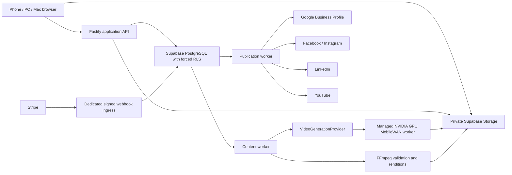

# Review Anchor Simplified Google Profile and Content Product Design

**Date:** 2026-07-21

**Status:** Product scope and architecture approved by the product owner

**Repository:** `C:\Users\Nick\Documents\Review App`

**Purpose:** Define the smallest credible direct-business and agency product before any application implementation begins.

## 1. Decision summary

Review Anchor will become a focused Google Business Profile and content-publishing product.

Its promise is:

> Keep your Google Profile current, ask genuine customers for reviews, and publish approved business content everywhere.

The selected approach is a modular extension of the existing React, Fastify, PostgreSQL, worker, Google OAuth, Stripe, QR, review-request, audit, and tenant-isolation foundation. The only external compute boundary is a replaceable managed NVIDIA GPU video provider running MobileWAN.

The product will not attempt to become a local-SEO rank tracker, citation manager, website builder, white-label marketing suite, professional video editor, or autonomous strategy agent.

## 2. Binding product principles

1. Google reviews live inside **Google Business Profile**, never in a separate top-level reputation product.
2. Phone, PC, and Mac are browser clients. MobileWAN does not run in the customer browser or on the customer device.
3. Manual image and video upload remains useful when the GPU service is unavailable.
4. Free users may manually upload and immediately publish their own approved content through every production-ready connected adapter.
5. Paid users receive scheduling and MobileWAN generation allowances.
6. Generated videos, Google review replies, profile edits, offers, and scheduled publications require explicit approval.
7. One content item fans out to independent destination jobs. One platform failure never rolls back a successful platform.
8. The application never silently substitutes a different video model.
9. Unsupported platform capabilities are disabled with a reason or replaced by **Download for manual upload**.
10. Security, tenant isolation, idempotency, audit history, and provider reconciliation are simplified internally only when safety is preserved.

## 3. Product navigation

### 3.1 Shared navigation

| Area | Contents |
|---|---|
| **Home** | Action inbox, connection health, drafts awaiting action, scheduled items, recent results, and allowance summary. |
| **Google Profile** | Profile, Reviews, Review requests & QR, and Posts & Media. |
| **Content** | Create, Uploads, Approvals, Scheduled, Published, and Failed. |
| **Reports** | Review-request outcomes, current review snapshot, publishing outcomes, MobileWAN usage, and completed actions. |
| **Settings & Billing** | Connections, business/location settings, users, plans, credits, storage, exports, deletion, and consent records. |

### 3.2 Agency experience

Agency users see the same product with:

- a persistent client and location selector;
- an **Agency** portfolio page for readiness, pending approvals, failed destinations, and allowance use;
- client-level usage caps;
- explicit client-approved access.

Detailed exceptions and audit data remain internal or secondary administrative views. They are removed from everyday navigation but not deleted from the security model.

### 3.3 Current-route consolidation

| Current area | New home |
|---|---|
| Growth | Home |
| Reviews | Google Profile → Reviews |
| Customer requests | Google Profile → Review requests & QR |
| Review workflow | Google Profile → Review requests & QR |
| QR codes | Google Profile → Review requests & QR |
| Integrations | Google Profile for Google; Settings for other platforms |
| Reports | Reports |
| Team & billing | Settings & Billing |
| Agency portfolio/clients | Agency |
| Exceptions/audit | Secondary operations views |

Legacy routes redirect to their new destinations so bookmarks do not break.

## 4. Complete feature decision matrix

### 4.1 Keep

- Google Business Profile description.
- Services and service descriptions supported by the location category.
- Supported location attributes.
- Social-link completeness checking; apply through the API only when a writable field is available, otherwise deep-link to Google's editor.
- Current Google review feed and rating summary.
- Google review link and downloadable/printable QR code.
- Neutral email/SMS review requests, consent controls, quiet hours, opt-out, and one reminder.
- Approval-first review reply suggestions and explicit publication.
- Google profile images and videos.
- Google local updates, events, and offers where the API supports them.
- Google change/connection alerts.
- Browser image and video uploads from desktop or mobile.
- Immediate and scheduled publishing to Google Business Profile, Facebook Pages, Instagram professional accounts, LinkedIn organisations, and YouTube channels.
- Paid MobileWAN video generation through a managed NVIDIA GPU worker.
- Captions, descriptions, hashtags, calls to action, and destination-specific copy.
- A small service-curated set of fully licensed music choices, including a silent option; no open music marketplace.
- Immutable approval, retry, failure, and publication history.
- Monthly outcome reporting and completed-action history.
- Direct-business and agency workflows.

### 4.2 Simplify

- **Automated review replies:** create a safe draft; require one-tap approval before publishing.
- **Google optimisation:** show current value, proposed value, policy validation, and exact diff; require **Apply**.
- **AI Account Manager:** replace with a deterministic action inbox and monthly digest.
- **Image automation:** one shared asset library and publishing flow, not separate dripping/geotagging products.
- **Video editing:** trim, focal crop, caption, thumbnail, and regenerate only.
- **Permissions:** Owner, Staff, and Client Approver in the product UI.
- **Reporting:** current review/request/content outcomes only; no SEO rank suite.
- **Offers:** customer-authored facts, dates, terms, CTA, approval, and schedule; no autonomous offer strategy.
- **Email customisation:** a small set of safe brand fields and approved templates; no arbitrary inbox impersonation or HTML email builder.

### 4.3 Remove from the product

- Monthly heatmaps and before/after heatmaps.
- Tracking up to ten keywords.
- AI-platform ranking audits.
- Citation management and 62 directory integrations.
- Citation duplicate protection and automatic directory synchronisation.
- Automatic negative-review flagging.
- Sentiment gating, positive-only review routes, or incentivised reviews.
- Autonomous strategy adjustments.
- Claims that an assistant is trained on one million data points.
- Weekly AI-written account-manager updates.
- Appreciation-message automation.
- Website post, review, and image widgets.
- White-label domains, interface rebranding, assistant renaming, and sending mail from the customer's inbox.
- Automatic geotagging and metadata tricks.
- Image dripping.
- Google Drive and webhook media imports.
- A professional video editor, timeline, layers, keyframes, colour grading, effects marketplace, multi-clip campaign builder, and large music catalogue or marketplace.
- Unlimited users and a custom permission builder.
- Zapier, CompanyCam, GBP audit-lead webhooks, and instant AI answers.
- Person-level claims that a specific review resulted from a specific request.

### 4.4 Later only after demonstrated demand

- Additional social destinations.
- Customer-supplied, rights-attested audio.
- Image-conditioned or portrait-native MobileWAN generation when a supported model advertises it.
- More advanced agency capacity and custom reporting.
- Generative copy through a separately approved `CopyProvider`.

Later features do not create dormant production buttons or placeholder providers.

## 5. Roles and agency access

### 5.1 Product roles

| Role | Allowed actions |
|---|---|
| **Owner** | Connections, profile changes, users, billing, generation, approval, scheduling, publishing, exports, and deletion. |
| **Staff** | Create drafts, upload assets, request generation, edit copy, propose schedules, and submit for approval. No billing or connection ownership. |
| **Client Approver** | Preview, approve, reject, or request changes for explicitly granted businesses/locations. No creation, billing, connection, or user administration. |

Existing internal database roles may remain more granular. The customer UI exposes only these three responsibilities.

### 5.2 Agency grant

Agency membership never grants access to a client automatically.

1. Agency requests access to a business and named locations.
2. Client Owner accepts the request.
3. The grant records create, submit, approve, schedule, publish, and agency-unit-spend permissions.
4. Client may revoke immediately.
5. Support sessions remain troubleshooting-only and cannot create, spend, approve, or publish.
6. Agency-created content requires a different Client Approver unless the client explicitly enables named agency self-approval.

## 6. Direct-business customer journey

1. Create account and business.
2. Add first location, timezone, locale, website, contact details, and approved CTA.
3. Connect the exact Google Business Profile location.
4. Review the profile checklist and apply approved description, service, and attribute changes.
5. Open Reviews inside Google Profile; generate, edit, approve, and publish replies one at a time.
6. Copy the Google review link or download the QR code.
7. Configure neutral review-request wording and one reminder.
8. Connect optional Facebook Page, Instagram professional account, LinkedIn organisation, and YouTube channel.
9. Upload a photo/video or choose paid MobileWAN generation.
10. Select service, offer, or social idea; synced Google review text is not a video source.
11. Choose destinations, format, caption, CTA, and publish-now or schedule.
12. Preview every destination rendition.
13. Explicitly approve the immutable revision.
14. Track per-platform upload, processing, live, retrying, or action-required state.
15. Review the monthly outcome summary and completed-action history.

## 7. Agency customer journey

1. Agency Owner creates the agency and subscription.
2. Invite Staff users.
3. Request access to an existing client or create an invitation for a new client business.
4. Client Owner accepts locations and permissions.
5. Agency assigns a soft monthly budget and optional hard video-generation cap.
6. Staff chooses the client and location from the persistent selector.
7. Staff creates or uploads content and submits it.
8. Client Approver receives an email/in-app request and approves, rejects, or requests changes.
9. Approved content publishes or schedules through the client's own connections.
10. Agency portfolio shows readiness, approvals, failures, allowance use, and upcoming schedules without exposing another client's data.

## 8. Google Business Profile design

### 8.1 Profile

- Fetch and display the current profile description, categories, supported services, service descriptions, attributes, hours, website, and available social-link fields.
- Display completeness and policy issues, not an invented ranking score.
- Proposed changes show an exact before/after diff.
- Owner approval is required for every mutation.
- Google-updated values are surfaced; the app never automatically reverts Google changes.
- The client can disconnect and regain exclusive control promptly.

### 8.2 Reviews

- Reviews appear as a tab within Google Profile.
- Review content is cached securely for no more than 30 calendar days.
- A deterministic reply composer produces a safe starting draft without inventing facts.
- The user may edit the draft and must click **Approve and publish**.
- Low rating alone never creates a report/flag action.
- A policy-violation help link may open Google reporting guidance.
- Synced Google review text is not copied into permanent reports, analytics, video prompts, or long-lived content projects.

### 8.3 Review requests and QR

- Google remains the review destination.
- No internal star screen, satisfaction pre-screen, incentive, or positive-only route.
- One initial request and one reminder are allowed.
- Reply, opt-out, revoked consent, or detected review cancels remaining messages where the existing policy safely supports it.
- Email does not consume SMS allowance; SMS continues using the existing segment accounting controls.

### 8.4 Posts and media

- Google images/videos and local posts use official APIs only.
- Supported post types are update, event, and offer.
- Product posts are not promised where Google does not support them.
- Location video and post media capabilities are presented separately.

## 9. Content and MobileWAN design

### 9.1 Content sources

Launch sources are:

- a service;
- an offer with exact dates and terms;
- a user-written social idea.

A user-supplied testimonial may be added later only with explicit rights attestation. Synced Google reviews are excluded from video generation.

### 9.2 Manual upload

- Browser upload from desktop or mobile.
- Direct private Storage upload using a server-authorised resumable token.
- If signed TUS cannot be securely used with the application's custom opaque sessions, use path-scoped signed S3 multipart upload.
- Never proxy large media through the existing 256 KiB JSON API limit.
- Validate magic bytes, size, checksum, codec, duration, dimensions, frame rate, malware, and decompression limits before use.

### 9.3 MobileWAN generation

```text
Phone / PC / Mac browser
        ↓
Upload assets and request video
        ↓
PostgreSQL-backed asynchronous job queue
        ↓
Managed NVIDIA GPU worker running MobileWAN
        ↓
Validate → preview → approve → publish/schedule
```

- The browser is the control plane only.
- Public MobileWAN launch capability is text-to-video: one silent, approximately five-second, 81-frame, 480×832 clip at 16 fps.
- Uploaded logos and business/product images are used in deterministic overlays, end cards, thumbnails, or padded target renditions; they are not presented as MobileWAN conditioning inputs.
- Vertical, square, and landscape deliverables use safe crop/pad templates unless the provider later advertises native formats.
- Captions, descriptions, hashtags, and CTAs are created from reviewed deterministic templates and remain editable.
- Prompt, seed, provider revision, model revision, output checksum, credit result, and approval revision are auditable.
- Initial prompt templates exclude people, celebrities, politics, medical claims, deceptive claims, and third-party brands.

### 9.4 Replaceable provider

```ts
export interface VideoGenerationProvider {
  readonly key: string;
  capabilities(): Promise<VideoCapabilities>;
  submit(request: VideoGenerationRequest): Promise<ProviderJob>;
  status(providerJobId: string): Promise<ProviderStatus>;
  cancel(providerJobId: string): Promise<ProviderStatus>;
  reconcile(providerJobId: string): Promise<ProviderResult>;
}
```

MobileWAN-specific imports remain inside one adapter/worker package. PostgreSQL stores provider keys and versions as data, not enums.

### 9.5 Simple changes

- Trim within the generated/uploaded clip.
- Choose a focal crop/pad template.
- Edit caption and CTA.
- Choose a thumbnail frame or uploaded thumbnail.
- Mute the clip or replace its soundtrack with one currently licensed service-curated track.
- Regenerate the clip.

Every change creates a new immutable revision. Regeneration spends another unit unless the provider definitively failed before creating a valid preview.

## 10. Social publishing

### 10.1 Supported destinations

- Google Business Profile location media/posts.
- Facebook Pages only.
- Instagram professional accounts only.
- LinkedIn organisations with an authorised Page role.
- YouTube channels.

Personal-profile automation is not offered.

### 10.2 Workflow

1. User connects an account and selects the exact destination.
2. Content validation intersects all selected destination capabilities.
3. User previews destination-specific copy and format.
4. Approval binds content hash, copy hash, targets, destination identities, and schedule.
5. Publish-now creates one due job per target.
6. Scheduling stores location timezone plus UTC execution time.
7. Each provider upload is independently retried and reconciled.
8. Successful platforms remain live when another fails.
9. Editing a failed target creates a new revision and new approval.

Every adapter remains capability-gated until required platform review, permissions, test account, and live pilot succeed.

## 11. Plans, allowances, and Stripe

### 11.1 Visible plans

Only three product names are presented:

| Capability | Free | Business | Agency |
|---|---:|---:|---:|
| Businesses | 1 | 1 | Up to 5 active client businesses |
| Locations | 1 | 1-location or up-to-5-location Price variant | Up to 10 active client locations |
| Users | 2 | 5 | 15 |
| Manual upload and publish-now | Yes | Yes | Yes for authorised clients |
| Scheduled publishing | No | Yes | Yes |
| MobileWAN clips/month | 0 | 4 | 30 pooled |
| Active generation jobs | 0 | 1 | 3 |
| Storage | 1 GB | 10 GB | 100 GB pooled |
| Approval | Owner self-confirmation | Owner/team | Client Approver or explicit delegation |
| Extra generation | No | Five-unit pack | Five-unit pack |

The existing Multi plan becomes a Business multi-location Price/entitlement variant rather than a fourth customer-facing product.

### 11.2 Unit rules

- One unit equals one technically valid native MobileWAN clip.
- Included units reset monthly and do not roll over, including annual subscriptions.
- Purchased five-unit packs expire 12 months after payment and have no cash value.
- Units are reserved earliest-expiry first.
- A valid preview consumes the unit even if the customer dislikes or rejects it.
- A definite technical failure releases the unit.
- An unknown provider outcome holds the reservation until reconciliation.
- Publication failure does not refund generation because the video exists.
- Infrastructure retries for one logical job never reserve another unit.

### 11.3 Pricing rule

Existing review-product Stripe prices remain unchanged until the video feasibility benchmark is complete. A video-inclusive Price or add-on is created only when:

`monthly price contribution ≥ included clips × measured p95 successful-clip cost × 3`

The same three-times p95-cost floor applies to a five-unit pack. This targets at least a two-thirds gross margin before support, tax, and payment costs. The product owner approves the final rounded GBP/USD amounts before Stripe products are created.

### 11.4 Stripe boundary

- Hosted Checkout and Customer Portal only.
- Server-owned Price IDs and plan keys.
- Exact-body signature-verified, replay-safe webhooks.
- Success redirects never grant access.
- Secrets never enter browser variables or source.
- No automatic Stripe Tax until required registrations are confirmed.
- PostgreSQL is the real-time allowance authority; Stripe is the payment/subscription authority.

## 12. Technical architecture



### 12.1 Process responsibilities

- **Web:** user journey and local upload progress only.
- **Application API:** authorization, validation, signed upload/read intents, entitlement decisions, and commands.
- **PostgreSQL:** authoritative tenant, job, credit, approval, schedule, idempotency, and audit state.
- **Storage:** private immutable objects; never an authorization authority.
- **Content worker:** validation, generation orchestration, state progression, and deterministic renditions.
- **GPU worker:** model-specific generation only; no database, Stripe, or social secrets.
- **Publication worker:** provider upload, processing polls, retry, and reconciliation.
- **Ingress:** signed Stripe/provider callback persistence only.

Long media and publication work does not run inside HTTP requests or the current sequential review-message loop.

## 13. Minimal data model

Reuse:

- users, agencies, businesses, locations, memberships, location grants, invitations;
- Google/integration connections and encrypted secrets;
- review records, review requests, QR codes, audit and consent records;
- current Stripe Checkout/webhook records as migration inputs;
- job lease, idempotency, unknown-outcome, and capability-role patterns.

Add:

| Table | Purpose |
|---|---|
| `agency_client_grants` | Client-approved agency/location/action access and revocation. |
| `commercial_accounts` | The business or agency payer, visible content plan, Stripe subscription projection, allowance period, and entitlement version. Existing `billing_accounts` remains the legacy review/SMS authority. |
| `social_destinations` | Exact Page, professional account, organisation, channel, or GBP location. |
| `media_assets` | Immutable original/derived object metadata, hash, status, and retention. Variants use `parent_asset_id`. |
| `licensed_audio_tracks` | Service-owned track metadata, object reference, territories, licence evidence, and validity window. |
| `content_items` | Source facts, caption, current immutable revision hash, creator, and state. |
| `content_targets` | Destination, format, schedule, publication lease/state, and remote resource ID. |
| `content_approvals` | Revision/target hash, approver, decision, note, and timestamp. |
| `video_generation_jobs` | Provider/model/prompt/seed, lease, progress, attempts, result, and reconciliation state. |
| `video_credit_ledger` | Immutable grant, reserve, consume, release, expire, revoke, and adjust entries. |
| `publication_attempts` | Safe provider request hash, attempt, result class, remote ID, and reconciliation data. |

Every tenant row includes `business_id`; every location row includes the composite `business_id` and `location_id` relationship. All new public tables enable and force RLS. Runtime processes use named security-definer commands with fixed search paths and explicit grants, not direct table writes.

## 14. State machines

### 14.1 Content

```text
draft → awaiting_approval → approved → scheduled/publishing
awaiting_approval → changes_requested → draft
scheduled/publishing → partially_published or published
```

### 14.2 Generation

```text
queued → preparing → generating → validating → preview_ready
                   ↘ retry_wait → preparing
                   ↘ unknown → reconciling → resolved
                   ↘ failed or cancelled
```

### 14.3 Publication target

```text
approved → scheduled/due → uploading → provider_processing → live
                                ↘ retry_wait → due
                                ↘ unknown → reconciling
                                ↘ action_required or failed
```

Approval and project state are projections of immutable revisions and child jobs, not replacements for history.

## 15. Failure handling

### Uploads

- Network interruption resumes from the confirmed offset.
- Expired upload intent creates a new immutable path.
- MIME, codec, size, checksum, malware, or decompression failure quarantines the asset.
- Orphaned uploads purge after 24 hours.

### Generation

- Provider rejection before acceptance releases credit.
- Definite technical failure releases credit.
- Accepted but uncertain work becomes `unknown` and is reconciled before retry.
- Browser closure does not cancel the server job.
- GPU outage leaves manual workflows available.
- Output upload failure retries upload before attempting generation again.

### Publishing

- Rate limits and documented transient errors retry with exponential backoff, jitter, and `Retry-After`.
- Authentication refresh happens once; repeated auth failure becomes `action_required`.
- Validation, permission, and policy failures do not retry automatically.
- Lost responses reconcile using provider session/resource identities before another upload.
- Expired offers cancel rather than publishing stale terms.

## 16. Security, moderation, licensing, and privacy

- Existing custom opaque sessions remain; Supabase Auth is not introduced.
- The browser receives only short-lived path-scoped Storage permissions.
- GPU workers receive short-lived signed input/output URLs and opaque job credentials only.
- Signed URLs, prompts, review text, OAuth tokens, Stripe secrets, and raw provider payloads are excluded from logs.
- Prompts and source facts are moderated before generation.
- Uploaded and generated media are technically validated and semantically moderated before approval.
- Human approval is mandatory for generated publication.
- Uploader attests ownership/permission for assets and identifiable people.
- No customer media is used for training without a separate explicit opt-in.
- MobileWAN code, weights, Wan2.2 dependencies, FFmpeg/codecs, and commercial output use require licence review.
- A track is selectable only while its commercial licence evidence and territory/date window are valid; an expired track blocks new renders but does not alter already published media.

### Retention defaults

| Data | Retention |
|---|---|
| Unused upload intents/orphans | 24 hours |
| Google API review content | Maximum 30 calendar days |
| Failed/unapproved generated media | 30 days |
| Generation prompt/brief | 30 days after terminal job |
| Brand/source media | Until user deletion or account termination plus a 30-day operational window |
| Approved/published renditions | 12 months after last publication by default |
| Platform egress copy | 24 hours after ingestion/expiry |
| Encrypted raw provider receipt | 30 days |
| Billing, approval, consent, publication, and security audit metadata | 24 months or longer where accounting law requires |

Deletion is lease-fenced, auditable, and blocked by an explicit legal/security hold only.

## 17. Reporting and notifications

### Home action inbox

Show only actionable events:

- Google/social connection needs attention;
- profile recommendation awaiting Apply;
- review reply awaiting approval;
- content awaiting approval;
- failed or unknown publication;
- expiring offer;
- generation allowance low/exhausted.

### Monthly summary

- requests sent/delivered/clicked and reviews detected;
- current Google rating/review snapshot;
- profile changes applied;
- content uploaded/generated;
- approved, scheduled, live, partial, and failed publications;
- generation units granted, consumed, released, and remaining;
- no heatmap, keyword ranking, AI ranking score, or citation count.

## 18. Responsive and accessible experience

- Validate at 360, 375, 390, 430, 768, 1024, and 1440 CSS pixels.
- Minimum 44×44 CSS-pixel touch targets.
- Keyboard operation, visible focus, labelled progress, reduced motion, and WCAG AA contrast.
- Persistent business/client/location context on every content and Google Profile screen.
- Creation uses short steps: Context → Source → Media → Destinations → Copy → Review → Approve → Publish.
- Drafts save after every committed step.
- Upload manager survives navigation.
- Preview loads a poster before video and never autoplays sound.
- No global camera or microphone permission request.

## 19. Delivery phases

### Phase 0 — prove external feasibility

- Benchmark the official MobileWAN Docker/sample on an NVIDIA A100 80 GB starting point.
- Record cold/warm latency, peak VRAM, valid-output rate, and cost per successful clip.
- Complete commercial licence review.
- Confirm Google write access for profile edits, reply publication, media, and local posts.
- Begin Meta, LinkedIn, and YouTube app-review/audit work.
- Prove signed resumable private Storage upload with the current custom session model.

### Phase 1 — simplify the current product

- Replace navigation and add legacy redirects.
- Move Reviews, requests, workflow, QR, and Google integration into Google Profile.
- Add authoritative client/location selection.
- Introduce Owner, Staff, and Client Approver product roles.
- Add client-approved agency grants.
- Remove retired marketing claims and dormant feature surfaces.

### Phase 2 — Google Profile value

- Profile checklist and approval-first changes.
- Nested review feed and approval-first replies.
- Review link/QR and one-request/one-reminder flow.
- Posts, offers, location images, and location videos.
- Action inbox and simple monthly outcome report.

### Phase 3 — manual content publishing

- Private resumable uploads and validation.
- Simple content composer and immutable revisions.
- Approval and one schedule field.
- Destination adapters released individually as external approvals pass.
- Complete free manual upload and publish-now journey before MobileWAN activation.

### Phase 4 — MobileWAN and paid allowance

- Deploy the isolated managed NVIDIA GPU worker.
- Implement the real provider adapter and job claim/status/reconcile protocol.
- Add generation UI, progress, preview, simple changes, and target renditions.
- Add monthly allowances, five-unit packs, reservation ledger, and Stripe enforcement.
- Add agency pooled allowance and per-client caps.

### Phase 5 — production hardening

- Direct-business and agency pilots.
- Worker crash/timeout/duplicate/unknown-state testing.
- Cross-tenant database and Storage isolation tests.
- OAuth revocation and reconnect testing.
- Stripe replay/out-of-order/refund testing.
- Mobile Chrome/Safari upload, preview, approval, and scheduling tests.
- Cost alarms, queue-age alerts, provider reconciliation, and deletion verification.

## 20. Release gates

The paid generated-video product does not launch until all are true:

1. MobileWAN produces at least ten technically valid representative clips.
2. p95 latency, VRAM, and successful-clip cost are measured.
3. Commercial use is approved for every model/runtime dependency.
4. No cross-tenant database row, signed URL, media object, approval, or allowance access is possible in automated isolation tests.
5. Approval binds an immutable revision and edits invalidate it.
6. Generation retry cannot double-reserve or double-consume a unit.
7. Unknown provider/publication outcomes reconcile before retry.
8. Every live social adapter has required platform approval and a controlled real pilot result.
9. Manual upload, Google Profile, reviews, and non-GPU publishing remain available during GPU outage.
10. Google review content retention never exceeds 30 days.
11. Review requests remain neutral, consented, suppressible, and unincentivised.
12. Generated content receives technical validation, moderation, and human approval.

## 21. Repository reuse and conflicts

### Reuse

- `src/routing.ts` business/location query context and legacy-route mapping.
- `server/routes/google.ts` OAuth/PKCE, selection, sync, disconnect, and actor binding.
- `server/providers/google.ts` token refresh and review import foundation.
- `src/platform/QrCodesView.tsx` QR generation/export patterns.
- `database/migrations/001_multi_tenant_foundation.sql` tenant/membership/agency/RLS foundation.
- `database/migrations/002_client_qr_review_flow.sql` public review/QR flow.
- `database/migrations/003_authenticated_review_automation.sql` review sync, message jobs, consent, and lease patterns.
- `database/migrations/004_sms_billing_and_location_reporting.sql` atomic SMS accounting pattern.
- `database/migrations/005_stripe_checkout_and_webhooks.sql` Checkout, Portal, signed webhook, replay, and price-validation foundation.
- `server/worker.ts` process-capability and lease patterns, not its sequential review-only loop.
- Existing reporting, audit, support-session, CSP, secret-scan, and database-isolation tests.

### Conflicts to resolve

- `src/App.tsx` is already large; new Google Profile and Content areas must be focused feature modules.
- Current Reviews, requests, automation, QR, integration, and billing navigation is fragmented.
- Current Google implementation reads profiles/reviews but has no profile, reply, post, offer, image, or video mutations.
- Current agency support sessions are not durable client delegation.
- Current Stripe model is business/SMS-specific and has no video allowance or agency payer.
- New content/video entitlements use `commercial_accounts`; the current business-only `billing_accounts` table remains authoritative for legacy review/SMS charges and is not stretched into an agency payer model.
- Current worker is review-message oriented and must not execute long media work.
- No private Storage, media schema, generation provider, approval, schedule, or social adapter exists.
- Cloudflare Pages remains a secret-free static demo and never receives media, provider, Stripe, or social secrets.

## 22. Official technical references

- [Google Business Profile API policies](https://developers.google.com/my-business/content/policies)
- [Google Business Profile location fields](https://developers.google.com/my-business/reference/businessinformation/rest/v1/locations)
- [Google Business Profile services](https://developers.google.com/my-business/content/services)
- [Google Business Profile attributes](https://developers.google.com/my-business/content/attributes)
- [Google Business Profile reviews and replies](https://developers.google.com/my-business/content/review-data)
- [Google Business Profile local posts](https://developers.google.com/my-business/content/posts-data)
- [Google Business Profile media uploads](https://developers.google.com/my-business/content/upload-photos)
- [Supabase private Storage buckets](https://supabase.com/docs/guides/storage/buckets/fundamentals)
- [Supabase resumable uploads](https://supabase.com/docs/guides/storage/uploads/resumable-uploads)
- [Stripe subscription webhooks](https://docs.stripe.com/billing/subscriptions/webhooks)
- [Stripe webhook security](https://docs.stripe.com/webhooks)
- [MobileWAN GitHub repository](https://github.com/qualcomm-ai-research/mobilewan)
- [MobileWAN Hugging Face model card and weights](https://huggingface.co/Qualcomm-AI-Research/mobilewan)
- [MobileWAN paper](https://arxiv.org/abs/2607.06173)
- [Qualcomm Responsible AI License](https://www.qualcomm.com/site/responsible-ai-license)
- [Instagram content publishing](https://developers.facebook.com/docs/instagram-platform/content-publishing/)
- [Facebook Reels publishing](https://developers.facebook.com/docs/video-api/guides/reels-publishing/)
- [LinkedIn Posts API](https://learn.microsoft.com/en-us/linkedin/marketing/community-management/shares/posts-api)
- [LinkedIn Videos API](https://learn.microsoft.com/en-us/linkedin/marketing/community-management/shares/videos-api)
- [YouTube resumable uploads](https://developers.google.com/youtube/v3/guides/using_resumable_upload_protocol)

## 23. Final non-goals

This design does not authorise or imply:

- a native Android or iOS application;
- MobileWAN running on customer hardware;
- browser-based model inference;
- another video model as a temporary fallback;
- a local-SEO/citation/rank-tracking platform;
- automatic publishing without approval;
- an autonomous reply/strategy agent;
- an advanced video editor;
- unsupported personal-profile publishing;
- provider success claims before real pilot validation.

The next artifact, after written-spec approval, is a task-by-task implementation plan. Application code must not change before that plan is approved.
